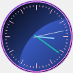

# Overview

Essential Tools for Windows Forms supports [Clock](https://help.syncfusion.com/cr/windowsforms/Syncfusion.Tools.Windows~Syncfusion.Windows.Forms.Tools.Clock.html) control in an application. This feature enables you to add customizable analog clocks in the application.

## Key features

**Clock Types** - Provides different types of clock. The types are Analog and Digital.

**Shapes** - Provides different shapes of clock. The shapes are Rectangle, RoundedRectangle, Circle, Square and RoundedSquare.

**Custom Time** - To enable the custom time, the control should be enabled with `ShowCustomTimeClock` property set as `true`.

**Frames** - Provides different set of frames. The frames are, RectangularFrame, CircleFrame and SquareFrame.

