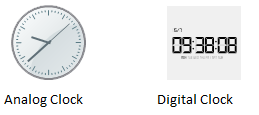

# Windows Forms Clock Overview

Essential Tools for Windows Forms supports [Clock](https://help.syncfusion.com/cr/windowsforms/Syncfusion.Windows.Forms.Tools.Clock.html) control in an application. This feature enables you to add customizable analog clocks in the application.

## Key features

* **Clock types** - Provides different types of clocks. The types are Analog and Digital.

* **Shapes** - Provides different clock shapes. The shapes are Rectangle, RoundedRectangle, Circle, Square, and RoundedSquare.

* **Custom time** - Enables custom time display. The control should be enabled by setting the `ShowCustomTimeClock` property to `true`.

* **Frames** - Provides different sets of frames. The frames are RectangularFrame, CircularFrame, and SquareFrame.
