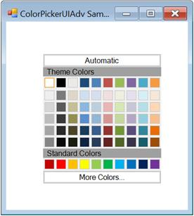

# Getting Started

This section briefly describes how to create a new Windows Forms project in Visual Studio and add **ColorPickerUIAdv** with it’s basic functionalities.

## Assembly deployment

Refer to the [control dependencies](https://help.syncfusion.com/windowsforms/control-dependencies#colorpickeruiadv) section to get the list of assemblies or NuGet package details which needs to be added as reference to use the control in any application.

[Click here](https://help.syncfusion.com/windowsforms/nuget-packages) to find more details on how to install nuget packages in Windows Forms application.

## Adding the ColorPickerUIAdv control via designer

1) Create a new Windows Forms application in Visual Studio.

2) The **ColorPickerUIAdv** control can be added to an application by dragging it from the toolbox to design view. The following dependent assemblies will be added automatically.

* Syncfusion.Grid.Base
* Syncfusion.Grid.Windows
* Syncfusion.Shared.Base
* Syncfusion.Shared.Windows
* Syncfusion.Tools.Base
* Syncfusion.Tools.Windows

 

## Adding the ColorPickerUIAdv control via code

It can be added programmatically by performing the following steps.

1) Create a C# or VB application via Visual Studio.

2) Add the following assembly references to the project.
	
* Syncfusion.Grid.Base
* Syncfusion.Grid.Windows
* Syncfusion.Shared.Base
* Syncfusion.Shared.Windows
* Syncfusion.Tools.Base
* Syncfusion.Tools.Windows

3) Include the required namespace.




using Syncfusion.Windows.Forms.Tools;





Imports Syncfusion.Windows.Forms.Tools




4) Create an instance of **ColorPickerUIAdv** and add it to the form.




private Syncfusion.Windows.Forms.Tools.ColorPickerUIAdv colorPickerUIAdv1;
ColorPickerUIAdv cpa = new ColorPickerUIAdv();
cpa.Size = new Size(200, 180);
this.Controls.Add(cpa);





Private colorPickerUIAdv1 As Syncfusion.Windows.Forms.Tools.ColorPickerUIAdv 
Private cpa As ColorPickerUIadv = New ColorPickerUIadv()
Private cpa.Size = New Size(200, 180)
Me.Controls.Add(cpa)
 



    

## Color Selection

At runtime a particular color should be focused or selected by using `SelectedColor` property.





this.colorPickerUIAdv1.SelectedColor = System.Drawing.Color.White;





Me.colorPickerUIAdv1.SelectedColor = System.Drawing.Color.White





