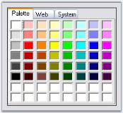
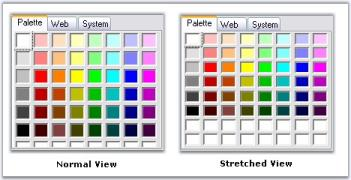
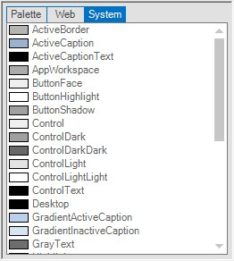

# ColorUIControl Appearance in Windows Forms ColorUI

This section discusses the appearance, border styles, and size settings of the ColorUIControl.

## Border Styles

The border style for the ColorUIControl can be set through the `BorderStyle` property.

<table>
<tr>
<th>
ColorUIControl Properties</th><th>
Description</th></tr>
<tr>
<td>
BorderStyle</td><td>
Sets the border style for the control. The options are `FixedSingle`, `Fixed3D` (default), and `None`.</td></tr>
</table>




this.colorUIControl1.BorderStyle = System.Windows.Forms.BorderStyle.FixedSingle;





Me.colorUIControl1.BorderStyle = System.Windows.Forms.BorderStyle.FixedSingle




## Panel Sizing

The Custom and User color panels can be stretched according to the size of the control using the following properties.

<table>
<tr>
<th>
ColorUIControl Properties</th><th>
Description</th></tr>
<tr>
<td>
CustomColorsStretchOnResize</td><td>
Gets or sets a value indicating whether to stretch the Custom Colors panel on resize.</td></tr>
<tr>
<td>
UserColorsStretchOnResize</td><td>
Gets or sets a value indicating whether to stretch the User Colors panel on resize.</td></tr>
</table>




this.colorUIControl1.CustomColorsStretchOnResize = true;
this.colorUIControl1.UserColorsStretchOnResize = true;





Me.colorUIControl1.CustomColorsStretchOnResize = True
Me.colorUIControl1.UserColorsStretchOnResize = True




## VisualStyle

`VisualStyle` provides a rich and professional look and feel UI for the ColorUIControl. Some of the available visual styles are as follows:

* `Default`
* `Office2010`
* `Metro`
* `Office2016Colorful`
* `Office2016White`
* `Office2016Black`
* `Office2016DarkGray`

The visual style can be applied for the ColorUIControl using the `VisualStyle` property.




//Set the visual Style of the ColorUIControl control.
this.colorUIControl1.VisualStyle = Syncfusion.Windows.Forms.ColorUIStyle.Office2016Colorful;





'Set the visual Style of the ColorUI control.
Me.colorUIControl1.VisualStyle = Syncfusion.Windows.Forms.ColorUIStyle.Office2016Colorful
 



