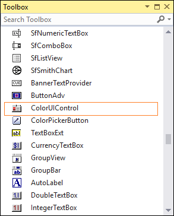
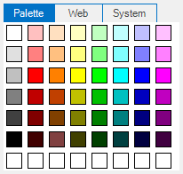

# Getting Started

This section briefly describes how to create a new Windows Forms project in Visual Studio and add **ColorUI** with it’s basic functionalities.

## Assembly deployment

Refer to the [control dependencies](https://help.syncfusion.com/windowsforms/control-dependencies#coloruicontrol) section to get the list of assemblies or NuGet package details which needs to be added as reference to use the control in any application.

[Click here](https://help.syncfusion.com/windowsforms/nuget-packages) to find more details on how to install nuget packages in Windows Forms application.

## Adding the ColorUI control via designer

1) Create a new Windows Forms application in Visual Studio.

2) The **ColorUI** control can be added to an application by dragging it from the toolbox to design view. The following dependent assemblies will be added automatically.

* Syncfusion.Shared.Base

## Adding the ColorUI control via code

The following steps illustrate how to create an **ColorUI** control programmatically:

1) Create a C# or VB application via Visual Studio.

2) Add the following assembly reference to the project.

* Syncfusion.Shared.Base

3) Include the required namespace.




using Syncfusion.Windows.Forms;





Imports Syncfusion.Windows.Forms




4) Create an instance of the **ColorUIControl** control. Specify its size and add it to the form.




// Declaring and Initializing the control
private Syncfusion.Windows.Forms.ColorUIControl colorUIControl1;
this.colorUIControl1=new Syncfusion.Windows.Forms.ColorUIControl();

//Specify the size for the control
this.colorUIControl1.Size = new System.Drawing.Size(210, 200);
Adding ColorUIControl to the form
this.Controls.Add(this.colorUIControl1);





' Declaring and Initializing the control
Private colorUIControl1 As Syncfusion.Windows.Forms.ColorUIControl
Me.colorUIControl1 = New Syncfusion.Windows.Forms.ColorUIControl()

'Specify the size for the control
Me.colorUIControl1.Size = New System.Drawing.Size(210, 200)

' Adding ColorUIControl to the form
Me.Controls.Add(Me.colorUIControl1)




   

## Selecting color and group

At run time a particular color group tab should be focused or selected by using `SelectedColorGroup` property.

The options are as follows,

* SystemColors
* StandardColors
* CustomColors
* UserColors
* None (Default)

Use `SelectedColor` property to specify the initially selected color.





this.colorUIControl1.SelectedColor = System.Drawing.Color.OrangeRed;
this.colorUIControl1.SelectedColorGroup = Syncfusion.Windows.Forms.ColorUISelectedGroup.StandardColors;





Me.colorUIControl1.SelectedColor = System.Drawing.Color.OrangeRed
Me.colorUIControl1.SelectedColorGroup = Syncfusion.Windows.Forms.ColorUISelectedGroup.StandardColors





N> These property settings can be reset using ResetSelectedColorGroup() and ResetSelectedColor() methods.