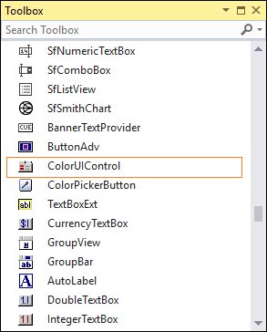
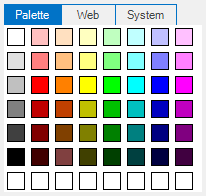
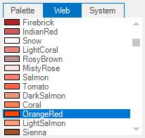

# Getting Started with Windows Forms ColorUI

This section briefly describes how to create a new Windows Forms project in Visual Studio and add **ColorUI** with its basic functionalities.

## Assembly deployment

Refer to the [Control Dependencies](https://help.syncfusion.com/windowsforms/control-dependencies#coloruicontrol) section to get the list of assemblies or details of the NuGet package that need to be added as a reference to use the control in any application.

Click [NuGet Packages](https://help.syncfusion.com/windowsforms/installation/install-nuget-packages) to learn how to install NuGet packages in a Windows Forms application.

## Adding the ColorUI control via designer

1. Create a new Windows Forms application in Visual Studio.

2. The [ColorUI](https://help.syncfusion.com/cr/windowsforms/Syncfusion.Windows.Forms.ColorUIControl.html) control can be added to an application by dragging it from the toolbox to the design view. The following dependent assembly will be added automatically:

* Syncfusion.Shared.Base

## Adding the ColorUI control via code

The following steps describe how to create a **ColorUI** control programmatically:

1. Create a C# or VB application using Visual Studio.

2. Add the following assembly reference to the project:

* Syncfusion.Shared.Base

3. Include the required namespace `Syncfusion.Windows.Forms`.





using Syncfusion.Windows.Forms;





Imports Syncfusion.Windows.Forms




{{ codesnippet1 | OrderList_Indent_Level_1 }}

4. Create an instance of the **ColorUI** control, specify its size, and add it to the form.





// Declaring and initializing the control.
private Syncfusion.Windows.Forms.ColorUIControl colorUIControl1;
this.colorUIControl1 = new Syncfusion.Windows.Forms.ColorUIControl();

// Specify the size for the control.
this.colorUIControl1.Size = new System.Drawing.Size(210, 200);

// Adding ColorUIControl to the form.
this.Controls.Add(this.colorUIControl1);





' Declaring and Initializing the control
Private colorUIControl1 As Syncfusion.Windows.Forms.ColorUIControl
Me.colorUIControl1 = New Syncfusion.Windows.Forms.ColorUIControl()

'Specify the size for the control
Me.colorUIControl1.Size = New System.Drawing.Size(210, 200)

' Adding ColorUIControl to the form
Me.Controls.Add(Me.colorUIControl1)




{{ codesnippet2 | OrderList_Indent_Level_1 }}

## Select a color and group

At runtime, a particular color group tab can be focused or selected using the [SelectedColorGroup](https://help.syncfusion.com/cr/windowsforms/Syncfusion.Windows.Forms.ColorUIControl.html#Syncfusion_Windows_Forms_ColorUIControl_SelectedColorGroup) property.

The available options are:

* `SystemColors`
* `StandardColors`
* `CustomColors`
* `UserColors`
* `None` (default)

Use the [SelectedColor](https://help.syncfusion.com/cr/windowsforms/Syncfusion.Windows.Forms.ColorUIControl.html#Syncfusion_Windows_Forms_ColorUIControl_SelectedColor) property to specify the initially selected color.





this.colorUIControl1.SelectedColor = System.Drawing.Color.OrangeRed;
this.colorUIControl1.SelectedColorGroup = Syncfusion.Windows.Forms.ColorUISelectedGroup.StandardColors;





Me.colorUIControl1.SelectedColor = System.Drawing.Color.OrangeRed
Me.colorUIControl1.SelectedColorGroup = Syncfusion.Windows.Forms.ColorUISelectedGroup.StandardColors





>**NOTE**: These property settings can be reset using the [ResetSelectedColorGroup()](https://help.syncfusion.com/cr/windowsforms/Syncfusion.Windows.Forms.ColorUIControl.html#Syncfusion_Windows_Forms_ColorUIControl_ResetSelectedColorGroup) and [ResetSelectedColor()](https://help.syncfusion.com/cr/windowsforms/Syncfusion.Windows.Forms.ColorUIControl.html#Syncfusion_Windows_Forms_ColorUIControl_ResetSelectedColor) methods.
