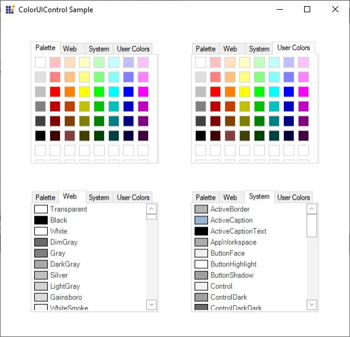

# Windows Forms ColorUI Overview

The ColorUIControl allows .NET developers to provide a standard user-interface that is similar to the Visual Studio and .NET color picker drop-down for selecting colors in Windows Forms applications. The ColorUIControl implements a palette type visual interface comprising of the System, Standard, Custom and User color groups. The control can be used either as a regular control hosted within a parent container or as a drop-down. Refer [ColorPickerButton](https://help.syncfusion.com/windowsforms/color-picker-dropdown/overview) to use ColorUIControl as a drop-down.

 

The .NET framework provides a color dialog control that allows applications to collect color information from users. However, the color dialog control does not allow to place a control within the layout of the application to collect color information. The ColorUIControl provides an easy-to-use color palette control that can be placed inline in applications.  

The ColorUIControl implements a palette type visual interface for selecting colors at run-time. The ColorUIControl class offers a selection of colors that are divided into four color groupings that are arranged as tabs. The four color groupings are:

* SystemColors consisting of colors defined within the SystemColors class.
* StandardColors consisting of basic colors.
* CustomColors providing a customizable color palette.
* UserColors providing different shades of user defined Colors 

## Key features

**Color Groups** - ColorUI has predefined set of colors named Standard, System, Custom, and User.

**Selected Color** - You can choose or get selected color both interactively and programmatically.