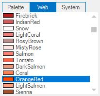

# Runtime Settings

At run time a particular color group tab should be focused or selected. Use SelectedColorGroup property of the ColorUI property for this purpose.

The options are as follows. 

* CustomColors
* StandardColors
* SystemColors
* UserColors
* None (Default)

Use SelectedColor property to specify the initially selected color. 




this.colorUIControl1.SelectedColorGroup = Syncfusion.Windows.Forms.ColorUISelectedGroup.StandardColors;
this.colorUIControl1.SelectedColor = System.Drawing.Color.OrangeRed;





Me.colorUIControl1.SelectedColorGroup = Syncfusion.Windows.Forms.ColorUISelectedGroup.StandardColors;
Me.colorUIControl1.SelectedColor = System.Drawing.Color.OrangeRed;




 

N> These property settings can be reset using ResetSelectedColorGroup() and ResetSelectedColor() methods.



[Color Groups](/windowsforms/colorui/color-groups)


