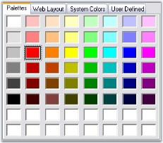

# Tab Text in Windows Forms ColorUI

The default tab text of the color groups can be set using the following properties.

<table>
<tr>
<th>
ColorUIControl Properties</th><th>
Description</th></tr>
<tr>
<td>
CustomTabName</td><td>
Sets the text displayed on the Custom Colors tab. The tab name can be reset using the `ResetCustomTabName()` method.</td></tr>
<tr>
<td>
StandardTabName</td><td>
Sets the text displayed on the Standard Colors tab. The tab name can be reset using the `ResetStandardTabName()` method.</td></tr>
<tr>
<td>
SystemTabName</td><td>
Sets the text displayed on the System Colors tab. The tab name can be reset using the `ResetSystemTabName()` method.</td></tr>
<tr>
<td>
UserTabName</td><td>
Sets the text displayed on the User Colors tab. The tab name can be reset using the `ResetUserTabName()` method.</td></tr>
</table>




this.colorUIControl1.StandardTabName = "Web Layout";
this.colorUIControl1.SystemTabName = "System Colors";
this.colorUIControl1.UserTabName = "User Defined";
this.colorUIControl1.CustomTabName = "Palettes";





Me.colorUIControl1.StandardTabName = "Web Layout"
Me.colorUIControl1.SystemTabName = "System Colors"
Me.colorUIControl1.UserTabName = "User Defined"
Me.colorUIControl1.CustomTabName = "Palettes"




>**NOTE**: The font style of the tab text can also be changed using the `ColorUIControl.Font` property.
