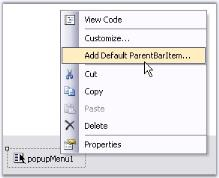

# How to Add a ColorUI Control to a Pop-Up Menu

To add ColorUIControl to a PopupMenu, we need to use PopupMenu, PopupControlContainer. Follow the below steps to add a ColorUIControl to a popup menu.

1. Drag and drop a ColorUIControl, a PopupMenu control, a PopupControlContainer control, a label control and a Panel control onto the form. Place the ColorUIControl inside the PopupControlContainer and the label inside the panel control.
2. Right click PopupMenu and select 'Add Default ParentBarItem" from the verbs. 

    

3. In the property grid of PopupMenu, expand ParentBarItem, then add a DropDownBarItem to the ParentBarItem using BarItem Collection Editor. Also set the PopupControlContainer as the DropDownBarItem's PopupControlContainer as shown in the image below.

    

4. In the MouseUp event of the Panel control call the PopupMenu.Show method.





private void panel1_MouseUp(object sender, MouseEventArgs e)
{
	this.popupMenu1.Show(this.panel1, new Point(e.X, e.Y));
}





Private Sub panel1_MouseUp(ByVal sender As Object, ByVal e As System.Windows.Forms.MouseEventArgs)
Me.popupMenu1.Show(Me.panel1, New Point(e.X, e.Y))
End Sub




{{ codesnippet1 | OrderList_Indent_Level_1 }}

    

N> You can close the popup whenever a color is selected at run time. This is done using ColorUIControl.ColorSelected Event.
