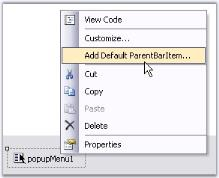
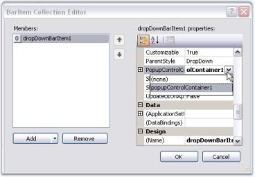
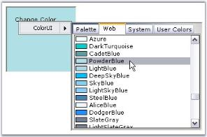

# How to Add ColorUI Control to a Popup Menu in ColorUI

To add a ColorUIControl to a `PopupMenu`, you need to use a `PopupMenu` and a `PopupControlContainer`. Follow the steps below to add a ColorUIControl to a popup menu.

1. Drag and drop a `ColorUIControl`, a `PopupMenu` control, a `PopupControlContainer` control, a `Label` control, and a `Panel` control onto the form. Place the `ColorUIControl` inside the `PopupControlContainer` and the `Label` inside the `Panel` control.

2. Right-click the `PopupMenu` and select **Add Default ParentBarItem** from the verbs.

   

3. In the property grid of the `PopupMenu`, expand `ParentBarItem`, then add a `DropDownBarItem` to the `ParentBarItem` using the BarItem Collection Editor. Also, set the `PopupControlContainer` as the `DropDownBarItem`'s `PopupControlContainer`, as shown in the image below.

   

4. In the `MouseUp` event of the `Panel` control, call the `PopupMenu.Show` method.




private void panel1_MouseUp(object sender, MouseEventArgs e)
{
	this.popupMenu1.Show(this.panel1, new Point(e.X, e.Y));
}





Private Sub panel1_MouseUp(ByVal sender As Object, ByVal e As System.Windows.Forms.MouseEventArgs)
Me.popupMenu1.Show(Me.panel1, New Point(e.X, e.Y))
End Sub




   

>**NOTE**: You can close the popup whenever a color is selected at runtime. This is done using the `ColorUIControl.ColorSelected` event.
