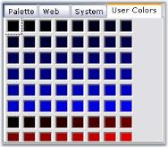

# How to Customize UserColors Group Cells in ColorUI

The color cells of the UserGroup panel in a ColorUIControl can be customized using the following code. You can use the `UserColors` and `UserCustomColors` collections for this purpose.




// For example, assume you have a ColorUIControl named colorUIControl1.
for (int i = 0; i < this.colorUIControl1.UserColors.Count; i++)
{
    this.colorUIControl1.UserColors[i] = Color.FromArgb(0, 0, i * 5);
}
for (int i = 0; i < this.colorUIControl1.UserCustomColors.Count; i++)
{
    this.colorUIControl1.UserCustomColors[i] = Color.FromArgb(i * 15, 0, 0);
}
this.colorUIControl1.SelectedColorGroup = Syncfusion.Windows.Forms.ColorUISelectedGroup.UserColors;

// Resize of ColorCells can be done using the UserColorsStretchOnResize property.
this.colorUIControl1.UserColorsStretchOnResize = true;





For i As Integer = 0 To Me.colorUIControl1.UserColors.Count - 1
    Me.colorUIControl1.UserColors(i) = Color.FromArgb(0, 0, i * 5)
Next
For i As Integer = 0 To Me.colorUIControl1.UserCustomColors.Count - 1
    Me.colorUIControl1.UserCustomColors(i) = Color.FromArgb(i * 15, 0, 0)
Next
Me.colorUIControl1.SelectedColorGroup = Syncfusion.Windows.Forms.ColorUISelectedGroup.UserColors

' Resize of ColorCells can be done using property UserColorsStretchOnResize.
Me.colorUIControl1.UserColorsStretchOnResize = True




>**NOTE**: `UserGroups` should be selected in the `ColorGroups` property for the above settings to take effect.

 
