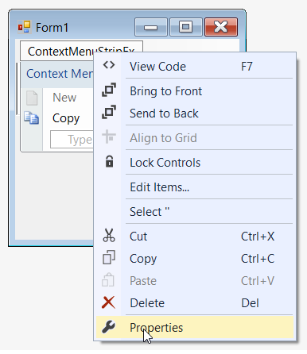
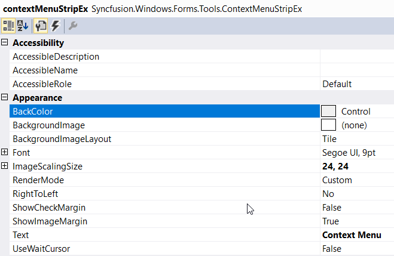
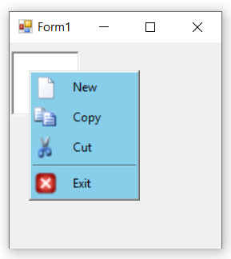
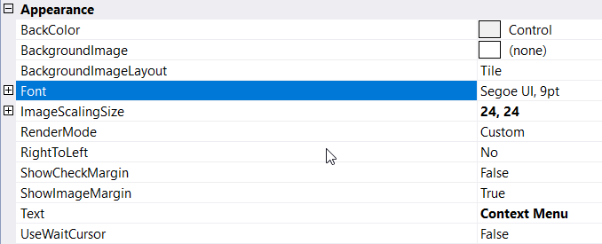
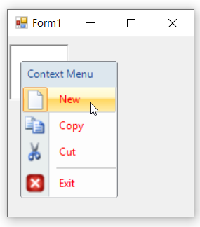
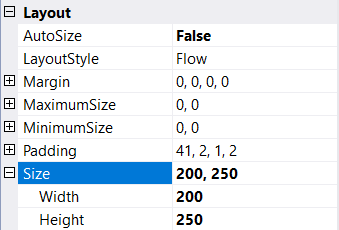
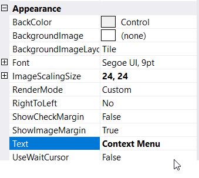
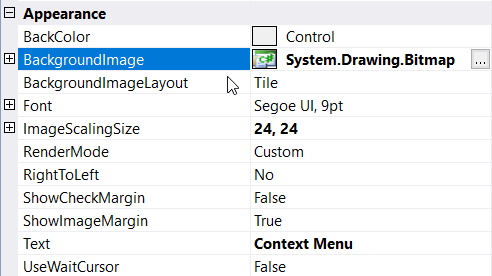

# Appearance Customization 

## Background Color

The **BackColor** property is to set the background color of ContextMenuStrip control.

### Through Designer

Once ContextMenuStripEx control is added, right-clicking on the control in the designer and select **Properties** option. Now, in the **Properties** panel, under **Appearance > BackColor** we need to choose the color.

### Through Code

The below code snippet will explain how to set background color of ContextMenuStrip control.




this.contextMenuStripEx.BackColor = System.Drawing.Color.SkyBlue;





Me.contextMenuStripEx.BackColor = System.Drawing.Color.SkyBlue




## Font

The **Font** property is to set the "FontFamily" and "FontStyle" of ContextMenuStrip control.

### Through Designer

We can set the font for menu item in the **Properties** panel, under **Appearance > Font** section.

### Through Code

The below code snippet will explain the procedure to set font for menu items.




this.contextMenuStripEx.Font = new System.Drawing.Font("Courier New", 9F, System.Drawing.FontStyle.Strikeout);





Me.contextMenuStripEx.Font = New System.Drawing.Font("Courier New", 9F, System.Drawing.FontStyle.Strikeout)




## Foreground Color

The **ForeColor** property is to set foreground color for menu items.




this.contextMenuStripEx.ForeColor = System.Drawing.Color.Red;





Me.contextMenuStripEx.ForeColor = System.Drawing.Color.Red




## Size

The **Size** property is to set the height and width of context menu items.

>**NOTE**:
In-order to set size for context menu, set **AutoSize** property to false.

### Through Designer

We can set the size for menu item in the **Properties** panel, under **Layout > Size** section.

### Through Code

The below code snippet is to set the size of context menu.




this.contextMenuStripEx.AutoSize = false;
this.contextMenuStripEx.Size = new System.Drawing.Size(200, 250);





Me.contextMenuStripEx.AutoSize = False
Me.contextMenuStripEx.Size = New System.Drawing.Size(200, 250)




## Text

The **Text** property is used to set the caption of ContextMenuStripEx control.

### Through Designer

We can set the text in the **Properties** panel, under **Appearance > Text** section.

### Through Code

The below code snippet will explain how to set text for ContextMenu.




this.contextMenuStripEx.Text = "Context Menu";





Me.contextMenuStripEx.Text = "Context Menu"




## Background Image

The **BackgroundImage** property is to set the background image of ContextMenuStripEx control.

### Through Designer

We can set background image in the **Properties** panel, under **Appearance > BackgroundImage** section.

### Through Code

The below code snippet is to set the background image of ContextMenu.




 this.contextMenuStripEx.BackgroundImage = System.Drawing.Image.FromFile(@"..\..\..\cut.png");





 Me.contextMenuStripEx.BackgroundImage = System.Drawing.Image.FromFile("..\..\..\cut.png")




