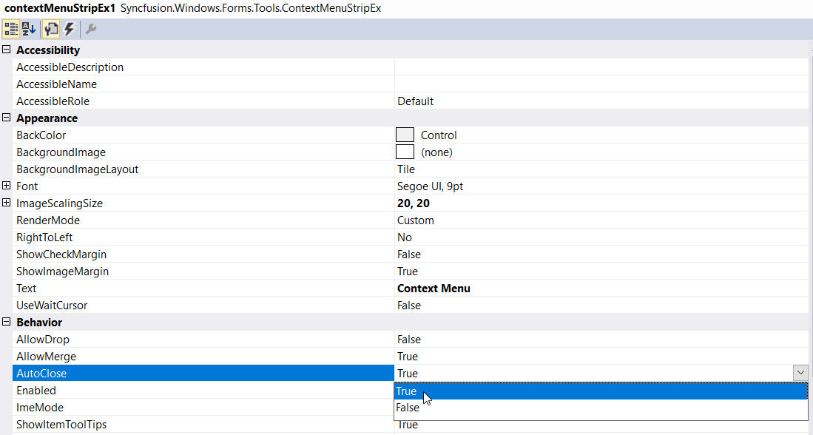

# Auto Close

When **AutoClose** property of the ContextMenuStrip control is set to **true**, context menu will get closed when user clicks on any item. If this is not enabled, the menu items will not be closed even after user action. By default it is set to **true**.
 
## Through Designer

Once ContextMenuStripEx control is added, right-clicking on the control in the designer and select **Properties** option. Now, in the **Properties** panel, under **Behavior > AutoClose** we need to set either true or false.

## Through Code

Below code snippet will explain how to set **AutoClose** property.




this.contextMenuStripEx1.AutoClose = true;





Me.contextMenuStripEx1.AutoClose = True



