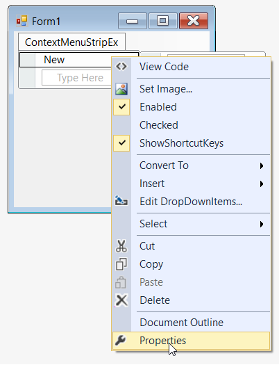
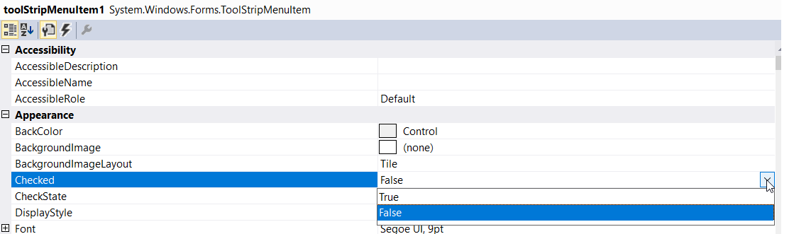
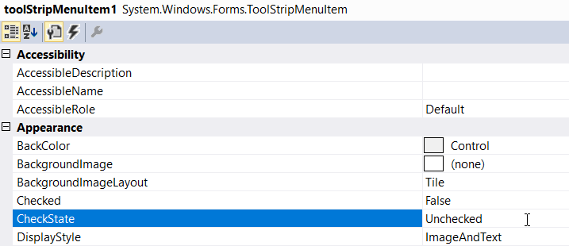

# Checked/unchecked menu items

The **Checked** property indicates whether a check mark should appear before the text of the menu item and **CheckedState** property specifies the check state (checked or unchecked) of the menu item.

>**NOTE:**       
>1. This feature is not applicable for combobox and textbox.       
>2. This feature will be displayed only if **ContextMenuStripEx.ShowCheckMargin** property is set to "true".

## Through Designer

1. Once menu items are added, we can set the check mark by right-clicking on the particular item in the designer and select **Properties** option. Now, in the **Properties** panel, under **Appearance > Checked** we need to set true.

2. Similarly, we can set the checked state of menu item in the **Properties** panel, under **Appearance > CheckedState** section.

## Through Code

Below code snippet will explain the state of the menu item.




//Declaration
private Syncfusion.Windows.Forms.Tools.ContextMenuStripEx contextMenuStripEx1;
private System.Windows.Forms.ToolStripMenuItem toolStripMenuItem1;

//Initializing
this.contextMenuStripEx1 = new Syncfusion.Windows.Forms.Tools.ContextMenuStripEx();
this.toolStripMenuItem1 = new System.Windows.Forms.ToolStripMenuItem();

this.contextMenuStripEx1.ShowCheckMargin = true;
this.toolStripMenuItem1.Checked = true;
this.toolStripMenuItem1.CheckState = System.Windows.Forms.CheckState.Checked;





'Declaration
Private contextMenuStripEx1 As Syncfusion.Windows.Forms.Tools.ContextMenuStripEx
Private toolStripMenuItem1 As System.Windows.Forms.ToolStripMenuItem

'Initializing
Me.contextMenuStripEx1 = New Syncfusion.Windows.Forms.Tools.ContextMenuStripEx()
Me.toolStripMenuItem1 = New System.Windows.Forms.ToolStripMenuItem()

Me.contextMenuStripEx1.ShowCheckMargin = True
Me.toolStripMenuItem1.Checked = True
Me.toolStripMenuItem1.CheckState = System.Windows.Forms.CheckState.Checked




