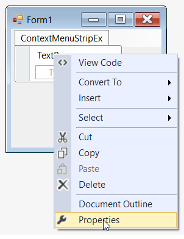
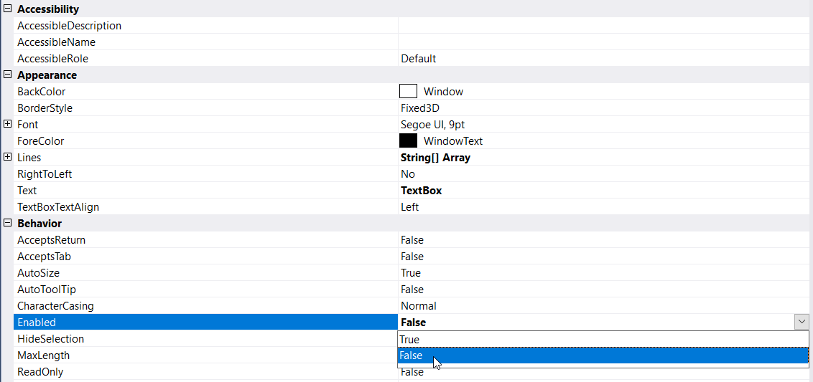

# Disable menu items

ToolStripItems are enabled by default when they are created, but this can be changed based on user requirement through the **Enabled** property. User can set this property at design time through the **Properties** window or programmatically by setting it in code.

## Through Designer

Once items are added, we can disable the item by right-clicking on the particular item in the designer and select **Properties** option. Now, in the **Properties** panel, under **Behavior > Enabled** we need to set as false.

## Through Code

The below code snippet will explain how to disable the ToolStripItems.




this.toolStripMenuItem1.Enabled = false;
this.toolStripTextBox1.Enabled = false;
this.toolStripComboBox1.Enabled = false;





Me.toolStripMenuItem1.Enabled = False
Me.toolStripTextBox1.Enabled = False
Me.toolStripComboBox1.Enabled = False




