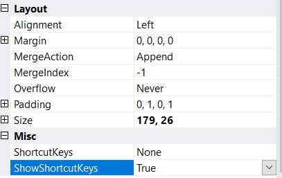
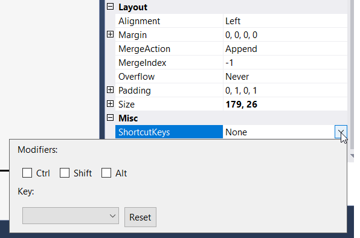
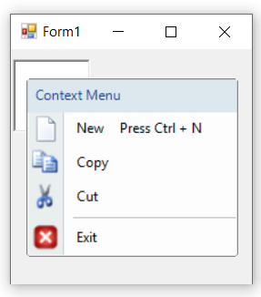

# Keyboard Shortcuts

The menu items can be selected through keyboard operation by specifying the shortcuts via the **ShortcutKeys** property of the ContextMenu.

>**NOTE**:        
> 1. This feature is not applicable for combobox and textbox.           
> 2. By using this keyboard shortcuts we can access the menu items through click event.

## Through Designer

1. The **ShowShortcutKeys** property is used for display the shortcut key on menu items.

2. Once menu items are added, we can set the shortcut keys by right-clicking on the particular item in the designer and select **Properties** option. Now, in the **Properties** panel, under **Misc > ShortcutKeys** we need to set the shortcut key.

## Through Code

The below code snippet shows how shortcut is assigned to the menu item.




this.toolStripMenuItem1.ShowShortcutKeys = true;
this.toolStripMenuItem1.ShortcutKeys = ((System.Windows.Forms.Keys)((System.Windows.Forms.Keys.Control | System.Windows.Forms.Keys.N)));





Me.toolStripMenuItem1.ShowShortcutKeys = True
Me.toolStripMenuItem1.ShortcutKeys = (CType((System.Windows.Forms.Keys.Control Or System.Windows.Forms.Keys.N), System.Windows.Forms.Keys))




**ShortcutKeyDisplayString** : You can modify the "ShortcutKey" string by using the **ShortcutKeyDisplayString** property.




this.toolStripMenuItem1.ShortcutKeyDisplayString = "Press Ctrl + N";





Me.toolStripMenuItem1.ShortcutKeyDisplayString = "Press Ctrl + N"




