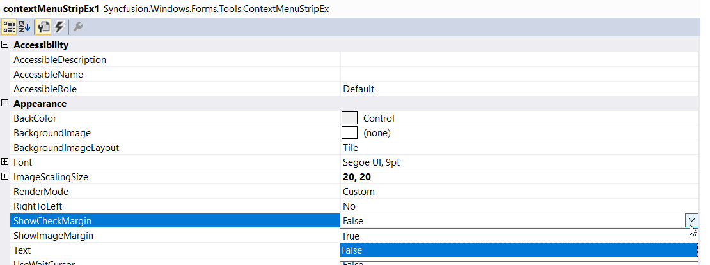
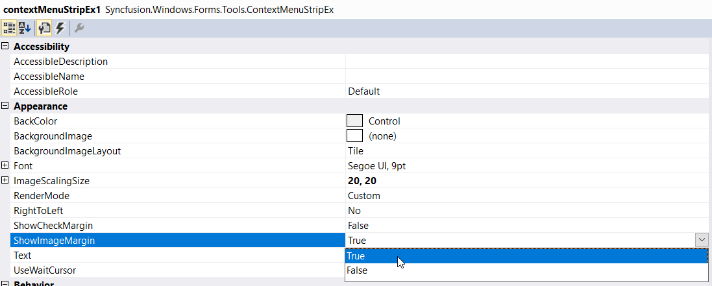
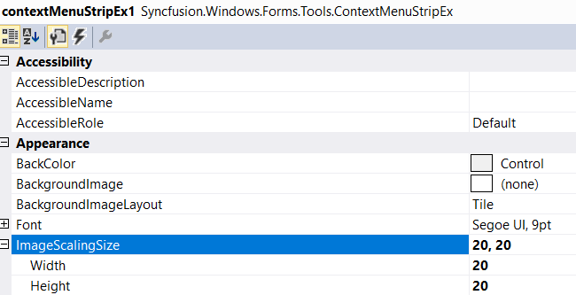
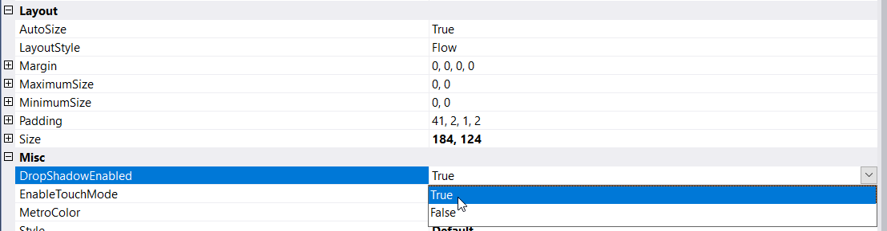
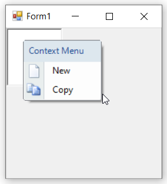

# Margin and Shadow

## Margin Setting

We can set margins for the context menu using the below properties.

<table>
<tr>
<th>
Property</th><th>
Description</th></tr>
<tr>
<td>
ShowCheckMargin</td><td>
Shows or hides check margin on the left side of the context menu.</td></tr>
<tr>
<td>
ShowImageMargin</td><td>
Shows or hides the image margin on the left side of the context menu.</td></tr>
<tr>
<td>
ImageScalingSize</td><td>
Sets the size of images on items.</td></tr>
</table>

### Through Designer

1. Once ContextMenuStripEx control is added, we can set the check margin by right-clicking on the control in the designer and select **Properties** option. Now, in the **Properties** panel, under **Appearance > ShowCheckMargin** we need to set either true or false.

2. Similarly, we can set the image margin in the **Properties** panel, under **Appearance > ShowImageMargin** section.

3. Similarly, we can set the image scalling size in the **Properties** panel, under **Appearance > ImageScallingSize** section.

### Through Code

The below code snippet will explain how to set the margin for ContextMenuStripEx control.




this.contextMenuStripEx.ShowCheckMargin = true;
this.contextMenuStripEx.ShowImageMargin = true;
this.contextMenuStripEx.ImageScalingSize = new System.Drawing.Size(24, 24);





Me.contextMenuStripEx.ShowCheckMargin = True
Me.contextMenuStripEx.ShowImageMargin = True
Me.contextMenuStripEx.ImageScalingSize = New System.Drawing.Size(24, 24)




>**NOTE**:
The check functionality can be enabled using the **Checked** property and check state can be provided  by using **CheckedState** property available for individual menu item.

## Shadow Setting

Shadow for the context menu drop down is controlled using the **DropShadowEnabled** property.

<table>
<tr>
<th>
Property</th><th>
Description</th></tr>
<tr>
<td>
DropShadowEnabled</td><td>
Shows or hides three dimensional shadow for the context menu.</td></tr>
</table>

### Through Designer

Once ContextMenuStripEx control is added, we can set the shadow by right-clicking on the control in the designer and select **Properties** option. Now, in the **Properties** panel, under **Misc > DropShadowEnabled** we need to set true.

### Through Code

The below code snippet will explain how to set shadow for ContextMenuStripEx control.




this.contextMenuStripEx1.DropShadowEnabled = true;





Me.contextMenuStripEx1.DropShadowEnabled = True




