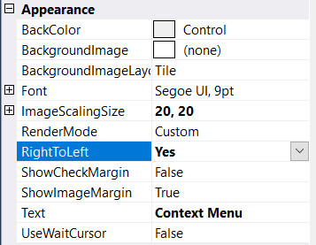

# RTL

RTL is used to display the content from right to left by setting the **RightToLeft** property to **Yes**.

## Through Designer

1. Once ContextMenuStripEx control is added, right-clicking on the control in the designer and select **Properties** option. Now, in the **Properties** panel, under **Appearance > RightToLeft** we need to set **Yes**.

## Through Code

The following code sample explains how to display the control from right-to-left.




this.contextMenuStripEx.RightToLeft = System.Windows.Forms.RightToLeft.Yes;





Me.contextMenuStripEx.RightToLeft = System.Windows.Forms.RightToLeft.Yes




