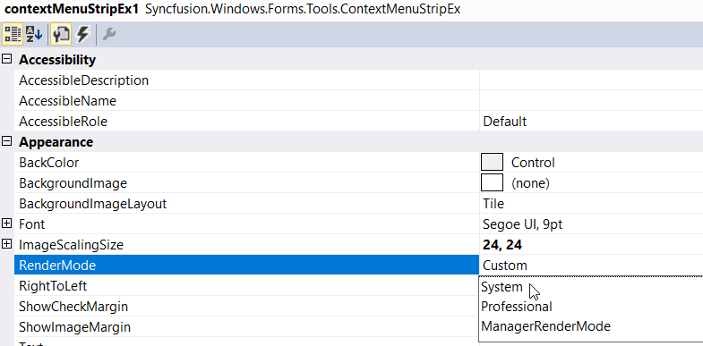
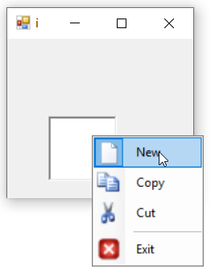
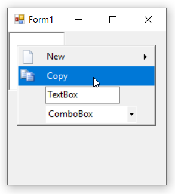
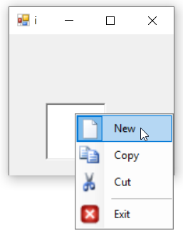
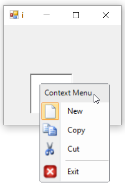
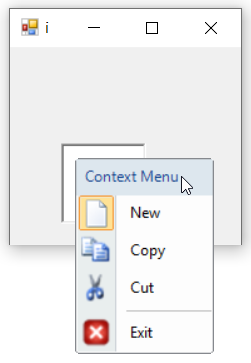
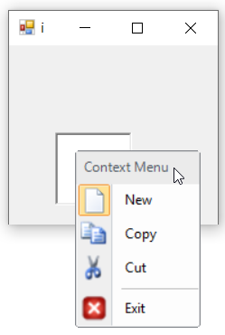

# Render Mode

The **RenderMode** property provides different painting styles like:

* Professional
* System
* ManagerRenderMode
* Custom

## Through Designer

Once ContextMenuStripEx control is added, we can set render mode by right-clicking on the control in the designer and select **Properties** option. Now, in the **Properties** panel, under **Appearance > RenderMode** we need to choose the render mode.

## Through Code

### Professional

The below code snippet is used to apply "Professional" style renderer.




this.contextMenuStripEx1.RenderMode = System.Windows.Forms.ToolStripRenderMode.Professional;





Me.contextMenuStripEx1.RenderMode = System.Windows.Forms.ToolStripRenderMode.Professional




### System

The below code snippet is used to apply "System" style renderer.




this.contextMenuStripEx1.RenderMode = System.Windows.Forms.ToolStripRenderMode.System;





Me.contextMenuStripEx1.RenderMode = System.Windows.Forms.ToolStripRenderMode.System




### ManagerRenderMode

The below code snippet is used to apply "ManagerRenderMode" style renderer.




this.contextMenuStripEx1.RenderMode = System.Windows.Forms.ToolStripRenderMode.ManagerRenderMode;





Me.contextMenuStripEx1.RenderMode = System.Windows.Forms.ToolStripRenderMode.ManagerRenderMode




### Custom

The RenderMode property cannot directly be set to **Custom** enumeration. To use a custom ToolStripRenderer, set the `Renderer` property directly instead. Here we have set the `Renderer` property to Office12ToolStripRenderer or Office2016ToolStripRenderer class object, which is used to change the appearance of the ContextMenuStripEx control.

In the form load event, add one of the below code to change the appearance.




//Sets Office Black Color
this.contextMenuStripEx1.Renderer = new Office12ToolStripRenderer(new OfficeBlack ());

//Sets Office Blue Color
this.contextMenuStripEx1.Renderer = new Office12ToolStripRenderer(new OfficeBlue ());

//Sets Office Silver Color
this.contextMenuStripEx1.Renderer = new Office12ToolStripRenderer(new Office12ColorTable());





'Sets Office Black Color
Me.contextMenuStripEx1.Renderer = New Office12ToolStripRenderer(New OfficeBlack) 

'Sets Office Blue Color
Me.contextMenuStripEx1.Renderer = New Office12ToolStripRenderer(New OfficeBlue)

'Sets Office Silver Color
Me.contextMenuStripEx1.Renderer = New Office12ToolStripRenderer(New Office12ColorTable())




 

 
  

