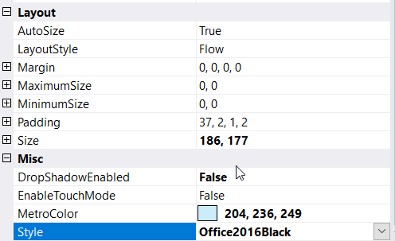

# Themes

Theming is the process of applying particular appearance settings to visual elements of a control. This control provides the following theming options:

* Default
* Metro
* Office2016Colorful
* Office2016White
* Office2016DarkGray
* Office2016Black

The **Style** property is used to set the visual style of ContextMenuStripEx control.

## Office2016Black

### Through Designer

Once ContextMenuStripEx control is added, we can set visual style by right-clicking on the control in the designer and select **Properties** option. Now, in the **Properties** panel, under **Misc > Style** we need to choose visual style.

### Through Code

The below code snippet will sets the visual style as "Office2016Black".




this.contextMenuStripEx1.Style = Syncfusion.Windows.Forms.Tools.ContextMenuStripEx.ContextMenuStyle.Office2016Black;





Me.contextMenuStripEx1.Style = Syncfusion.Windows.Forms.Tools.ContextMenuStripEx.ContextMenuStyle.Office2016Black




## Default

## Metro

## Office2016Colorful

## Office2016White

## Office2016DarkGray

