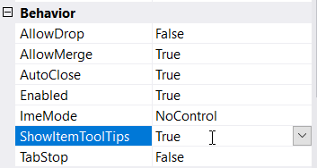
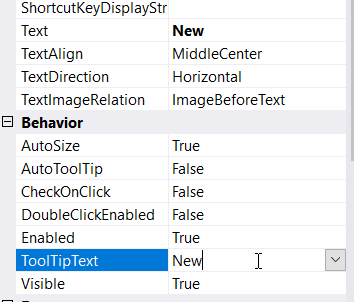
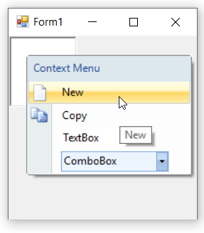
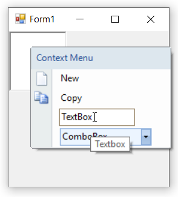
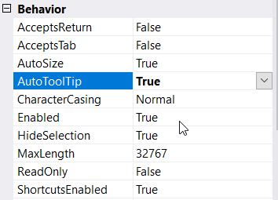

# Tooltip

By enabling **ShowItemToolTips** property, the menu items can display tooltips while mouse hovering. The **ToolTipText** property is used to set the text for the tooltip when **AutoToolTip** is set to false.

### Through Designer

1. Once ContextMenuStripEx control is added, right-click on the control in the designer and select **Properties** option. Now, in the **Properties** panel, under **Behavior > ShowItemToolTips** we need to set true.

2. Once items are added, we need to set the tooltip by right-click on the particular item in the designer and select **Properties** option. Now, in the **Properties** panel, under **Behavior > ToolTipText** we need to set the text.

3. The below image will shows a context menu with tooltip.

### Through Code

The below code snippet will explain how to set tooltip for context menu items.




this.contextMenuStripEx.ShowItemToolTips = true;
this.toolStripMenuItem1.ToolTipText = "New";
this.toolStripTextBox1.ToolTipText = "Textbox";
this.toolStripComboBox1.ToolTipText = "Combobox";





Me.contextMenuStripEx.ShowItemToolTips = True
Me.toolStripMenuItem1.ToolTipText = "New"
Me.toolStripTextBox1.ToolTipText = "Textbox"
Me.toolStripComboBox1.ToolTipText = "Combobox"




## Auto Tooltip

The **AutoTooltip** property is set to **false** by default. In such case, the control will display the text set in the **ToolTipText** property of the menu item. But on setting it to **true**, it will display the exact text set in the **Text** property if and only if **ToolTipText** property remains empty.

### Through Designer

Once items are added, we can set auto tooltip by right-clicking on the particular item in the designer and select **Properties** option. Now, in the **Properties** panel, under **Behavior > AutoToolTip** we need to set **true**.

### Through Code

The below code snippet will explain how to set auto tooltip for menu items.




this.toolStripMenuItem1.AutoToolTip = true;
this.toolStripTextBox1.AutoToolTip = true;
this.toolStripComboBox1.AutoToolTip = true;





Me.toolStripMenuItem1.AutoToolTip = True
Me.toolStripTextBox1.AutoToolTip = True
Me.toolStripComboBox1.AutoToolTip = True




