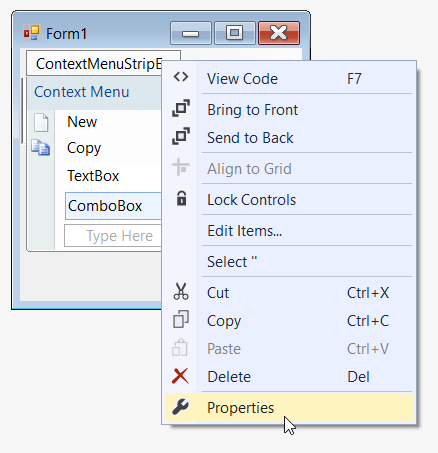
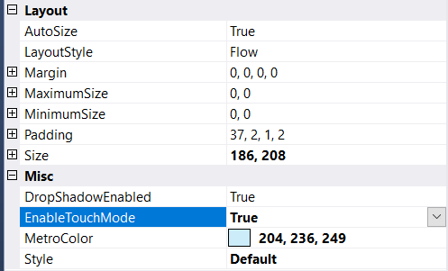

# Touch Mode

Touch mode is used to access the control easily in touch devices. This option can be enabled using the **EnableTouchMode** property in ContextMenuStripEx control.

## Through Designer

Once ContextMenuStripEx control is added, we can set touch mode by right-clicking on the control in the designer and select **Properties** option. Now, in the **Properties** panel, under **Misc > EnableTouchMode** we need to set **true**.

## Through Code

The below code snippet shows how touch mode is enabled in ContextMenuStripEx control.




this.contextMenuStripEx1.EnableTouchMode = true;





Me.contextMenuStripEx1.EnableTouchMode = True


