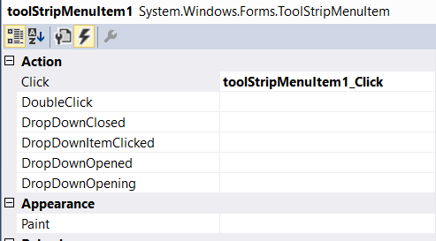
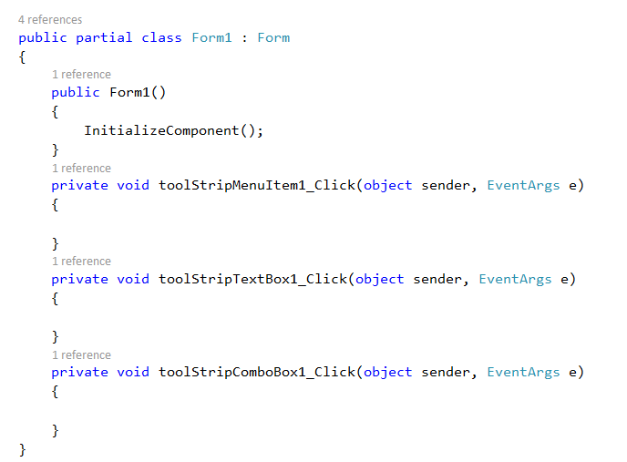

# Trigger Menu Item

The menu items are operated through the click event on selection.

> **Note**     
> Menu items can also be operated through keyboard shortcuts. The click event will be invoked when pressing the shortcut keys.

## Through Designer

1. The **Click** event can be created by double click on the particular menu items in designer.

2. Or, **Click** event can also be created in the **Properties** panel, under **Action > Click** section.

## Through Code

The below code snippet shows how to append click event for menu items through code behind.




this.toolStripMenuItem1.Click += new System.EventHandler(this.toolStripMenuItem1_Click);
this.toolStripTextBox1.Click += new System.EventHandler(this.toolStripTextBox1_Click);
this.toolStripComboBox1.Click += new System.EventHandler(this.toolStripComboBox1_Click);





AddHandler toolStripMenuItem1.Click, AddressOf toolStripMenuItem1_Click
AddHandler toolStripTextBox1.Click, AddressOf toolStripTextBox1_Click
AddHandler toolStripComboBox1.Click, AddressOf toolStripComboBox1_Click




