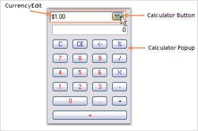

# Calculator Settings

A [CurrencyEdit](https://help.syncfusion.com/cr/windowsforms/Syncfusion.Tools.Windows~Syncfusion.Windows.Forms.Tools.CurrencyEdit.html) control has a text field and a Calculator button, pressing which will open a Calculator control. The below image illustrates the same.

 

The below properties which controls the behavior of the Calculator button.

* [ShowCalculator](https://help.syncfusion.com/cr/cref_files/windowsforms/Syncfusion.Tools.Windows~Syncfusion.Windows.Forms.Tools.CurrencyEdit~ShowCalculator.html)
* [CalculatorButton](https://help.syncfusion.com/cr/cref_files/windowsforms/Syncfusion.Tools.Windows~Syncfusion.Windows.Forms.Tools.CurrencyEdit~CalculatorButton.html)
* [CalculatorLayoutType](https://help.syncfusion.com/cr/cref_files/windowsforms/Syncfusion.Tools.Windows~Syncfusion.Windows.Forms.Tools.CurrencyEdit~CalculatorLayoutType.html)
* [PopupCalculatorAlignment](https://help.syncfusion.com/cr/cref_files/windowsforms/Syncfusion.Tools.Windows~Syncfusion.Windows.Forms.Tools.CurrencyEdit~PopupCalculatorAlignment.html)
* [CloseAction](https://help.syncfusion.com/cr/windowsforms/Syncfusion.Tools.Windows~Syncfusion.Windows.Forms.Tools.CurrencyEdit~CloseAction.html)





this.currencyEdit1.CalculatorLayoutType = Syncfusion.Windows.Forms.Tools.CalculatorLayoutTypes.WindowsStandard;

this.currencyEdit1.CloseAction = Syncfusion.Windows.Forms.Tools.CalcActions.CalcOperatorEquals;

this.currencyEdit1.PopupCalculatorAlignment = Syncfusion.Windows.Forms.Tools.CalculatorPopupAlignment.Left;

this.currencyEdit1.ShowCalculator = true;

this.currencyEdit1.TransferFromCalculator = true;

this.currencyEdit1.TransferToCalculator = true;





Me.currencyEdit1.CalculatorLayoutType = Syncfusion.Windows.Forms.Tools.CalculatorLayoutTypes.WindowsStandard

Me.currencyEdit1.CloseAction = Syncfusion.Windows.Forms.Tools.CalcActions.CalcOperatorEquals

Me.currencyEdit1.PopupCalculatorAlignment = Syncfusion.Windows.Forms.Tools.CalculatorPopupAlignment.Left

Me.currencyEdit1.ShowCalculator = True

Me.currencyEdit1.TransferFromCalculator = True

Me.currencyEdit1.TransferToCalculator = True



