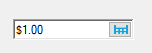

# Getting Started

## Assembly deployment

Refer to the [control dependencies](https://help.syncfusion.com/windowsforms/control-dependencies#currencyedit) section to get the list of assemblies or NuGet package that needs to be added as a reference to use the control in any application.

You can find more details about installing the NuGet packages in a Windows Forms application in the following link: 

[How to install nuget packages](https://help.syncfusion.com/windowsforms/nuget-packages)

### Create a simple application with CurrencyEdit

You can create a Windows Forms application with [CurrencyEdit](https://help.syncfusion.com/cr/windowsforms/Syncfusion.Tools.Windows~Syncfusion.Windows.Forms.Tools.CurrencyEdit.html) using the following steps:

### Create a project

Create a new Windows Forms project in Visual Studio to display the [CurrencyEdit](https://help.syncfusion.com/cr/windowsforms/Syncfusion.Tools.Windows~Syncfusion.Windows.Forms.Tools.CurrencyEdit.html) control.

## Add control through designer

The [CurrencyEdit](https://help.syncfusion.com/cr/windowsforms/Syncfusion.Tools.Windows~Syncfusion.Windows.Forms.Tools.CurrencyEdit.html) control can be added to an application by dragging it from the toolbox to a designer view. The following assembly references are added automatically:

* Syncfusion.Tools.Base
* Syncfusion.Tools.Windows
* Syncfusion.Grid.Base
* Syncfusion.Grid.Windows
* Syncfusion.Shared.Base
* Syncfusion.Shared.Windows

 

## Add control manually in code

To add the control manually in C#, follow the given steps:

**1.** Add the following required assembly references to the project: 

* Syncfusion.Tools.Base
* Syncfusion.Tools.Windows
* Syncfusion.Grid.Base
* Syncfusion.Grid.Windows
* Syncfusion.Shared.Base
* Syncfusion.Shared.Windows

**2.** Include the **Syncfusion.Windows.Forms.Tools** namespace.



using Syncfusion.Windows.Forms.Tools;


Imports Syncfusion.Windows.Forms.Tools



**3.** Create a [CurrencyEdit](https://help.syncfusion.com/cr/windowsforms/Syncfusion.Tools.Windows~Syncfusion.Windows.Forms.Tools.CurrencyEdit.html) instance, and add it to the window.



CurrencyEdit currencyEdit1 = new CurrencyEdit();
this.Controls.Add(currencyEdit1);


Dim currencyEdit1 As New CurrencyEdit()
Me.Controls.Add(currencyEdit1)



 

## Show or hide drop-down calculator

You can show or hide the calculator button in the CurrencyEdit control by setting the [ShowCalculator](https://help.syncfusion.com/cr/windowsforms/Syncfusion.Tools.Windows~Syncfusion.Windows.Forms.Tools.CurrencyEdit~ShowCalculator.html) property.



// Hide the calculator button
currencyEdit1.ShowCalculator = false;


' Hide the calculator button
currencyEdit1.ShowCalculator = False



 

