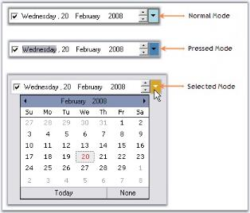
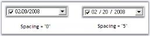

# Child controls

DateTimePickerAdv has child controls like DropDown, Updown arrows, checkbox. This section discusses the properties which controls the appearance and behavior of these controls.

## UpDown and DropDown buttons

This section discusses the properties of DateTimePickerAdv control which customizes the UpDown and DropDown buttons.

### UpDown buttons

The below properties controls the appearance and behavior of the UpDown buttons.

* [ShowUpDown](https://help.syncfusion.com/cr/windowsforms/Syncfusion.Tools.Windows~Syncfusion.Windows.Forms.Tools.DateTimePickerAdv~ShowUpDown.html)
* [ShowUpDownOnFocus](https://help.syncfusion.com/cr/windowsforms/Syncfusion.Tools.Windows~Syncfusion.Windows.Forms.Tools.DateTimePickerAdv~ShowUpDownOnFocus.html)
* [VSLikeUpDown](https://help.syncfusion.com/cr/windowsforms/Syncfusion.Tools.Windows~Syncfusion.Windows.Forms.Tools.DateTimePickerAdv~VSLikeUpDown.html)





this.dateTimePickerAdv2.ShowUpDown = true;

this.dateTimePickerAdv2.ShowUpDownOnFocus = true;





Me.dateTimePickerAdv2.ShowUpDown = True

Me.dateTimePickerAdv2.ShowUpDownOnFocus = True




In the below image, when focus is on button control, the updown button is hidden. In the second image, DateTimePickerAdv is focused and the UpDown button is shown.

 

 

 

### DropDown button

DropDown button in the DateTimePickerAdv is visible by default. To hide the dropdown button set [ShowDropButton](https://help.syncfusion.com/cr/windowsforms/Syncfusion.Tools.Windows~Syncfusion.Windows.Forms.Tools.DateTimePickerAdv~ShowDropButton.html) property to `false`. The below are the properties available, to change the default appearance of the control.

### Color settings

At run time, drop-down button can be in normal mode, pressed mode or in selected mode. Different colors can be set for different modes.

* [DropDownNormalColor](https://help.syncfusion.com/cr/windowsforms/Syncfusion.Tools.Windows~Syncfusion.Windows.Forms.Tools.DateTimePickerAdv~DropDownNormalColor.html)
* [DropDownPressedColor](https://help.syncfusion.com/cr/windowsforms/Syncfusion.Tools.Windows~Syncfusion.Windows.Forms.Tools.DateTimePickerAdv~DropDownPressedColor.html)
* [DropDownSelectedColor](https://help.syncfusion.com/cr/windowsforms/Syncfusion.Tools.Windows~Syncfusion.Windows.Forms.Tools.DateTimePickerAdv~DropDownSelectedColor.html)




this.dateTimePickerAdv2.DropDownNormalColor = System.Drawing.Color.LightBlue;

this.dateTimePickerAdv2.DropDownPressedColor = System.Drawing.Color.Goldenrod;

this.dateTimePickerAdv2.DropDownSelectedColor = System.Drawing.Color.SteelBlue;





Me.dateTimePickerAdv2.DropDownNormalColor = System.Drawing.Color.LightBlue

Me.dateTimePickerAdv2.DropDownPressedColor = System.Drawing.Color.Goldenrod

Me.dateTimePickerAdv2.DropDownSelectedColor = System.Drawing.Color.SteelBlue





N> These settings will be effective only when [DateTimePickerAdv.Style](https://help.syncfusion.com/cr/windowsforms/Syncfusion.Tools.Windows~Syncfusion.Windows.Forms.Tools.DateTimePickerAdv~Style.html) is Office2003, OfficeXP and VS2005.

### Flat appearance

Dropdown can be given flat appearance using [FlatDropDown](https://help.syncfusion.com/cr/windowsforms/Syncfusion.Tools.Windows~Syncfusion.Windows.Forms.Tools.DateTimePickerAdv~FlatDropButton.html) property. By default it is `false`.




this.dateTimePickerAdv2.FlatDropButton = true;





this.dateTimePickerAdv2.FlatDropButton = true;





N> These setting will be effective only when DateTimePickerAdv.Style is Default.

 

### Alignment of the DropDown

When the dropdown button is clicked, the calendar pops up, based on the alignment specified in [DropDownAlign](https://help.syncfusion.com/cr/windowsforms/Syncfusion.Tools.Windows~Syncfusion.Windows.Forms.Tools.DateTimePickerAdv~DropDownAlign.html) property. Default value is Left.





this.dateTimePickerAdv1.DropDownAlign = System.Windows.Forms.LeftRightAlignment.Right;





Me.dateTimePickerAdv1.DropDownAlign = System.Windows.Forms.LeftRightAlignment.Right





 

### Image for DropDown

The existing dropdown icon can be replaced with a custom image using the below properties.

* [DropDownImage](https://help.syncfusion.com/cr/windowsforms/Syncfusion.Tools.Windows~Syncfusion.Windows.Forms.Tools.DateTimePickerAdv~DropDownImage.html)
* [StretchDropDownImage](https://help.syncfusion.com/cr/windowsforms/Syncfusion.Tools.Windows~Syncfusion.Windows.Forms.Tools.DateTimePickerAdv~StretchDropDownImage.html)





this.dateTimePickerAdv1.DropDownImage = ((System.Drawing.Image)(resources.GetObject("dateTimePickerAdv1.DropDownImage")));

this.dateTimePickerAdv1.StretchDropDownImage = true;





Me.dateTimePickerAdv1.DropDownImage = DirectCast((resources.GetObject("dateTimePickerAdv1.DropDownImage")), System.Drawing.Image) 

Me.dateTimePickerAdv1.StretchDropDownImage = True 





 

 

 
 [Checkbox](#checkbox), [Text Field](#text-field)

 

## CheckBox

By default the DateTimePicker control has a checkbox in checked state. This checkbox can be hidden using [ShowCheckBox](https://help.syncfusion.com/cr/windowsforms/Syncfusion.Tools.Windows~Syncfusion.Windows.Forms.Tools.DateTimePickerAdv~ShowCheckBox.html) property and the state can be unchecked through designer, using [Checked](https://help.syncfusion.com/cr/windowsforms/Syncfusion.Tools.Windows~Syncfusion.Windows.Forms.Tools.DateTimePickerAdv~Checked.html) property.





this.dateTimePickerAdv1.ShowCheckBox = false;

this.dateTimePickerAdv5.Checked = false;





Me.dateTimePickerAdv1.ShowCheckBox = False

Me.dateTimePickerAdv5.Checked = False





 

 
[Text Field](#text-field), [UpDown and DropDown Buttons](#updown-and-dropdown-buttons)

 
 

## Text field

This section discusses the properties related to Checkbox and text field in the DateTimePicker control.

### Text field formatting

[Format](https://help.syncfusion.com/cr/windowsforms/Syncfusion.Tools.Windows~Syncfusion.Windows.Forms.Tools.DateTimePickerAdv~Format.html) and [CustomFormat](https://help.syncfusion.com/cr/windowsforms/Syncfusion.Tools.Windows~Syncfusion.Windows.Forms.Tools.DateTimePickerAdv~CustomFormat.html) properties are used to format the text field.





//Sets "Long" format for the text field

this.dateTimePickerAdv5.Format = System.Windows.Forms.DateTimePickerFormat.Long;

//Sets "Short" format for the text field

this.dateTimePickerAdv5.Format = System.Windows.Forms.DateTimePickerFormat.Short;

//Sets "Time" format for the text field

this.dateTimePickerAdv5.Format = System.Windows.Forms.DateTimePickerFormat.Time;

//Sets custom format for the text field

this.dateTimePickerAdv5.Format = System.Windows.Forms.DateTimePickerFormat.Custom;

this.dateTimePickerAdv5.CustomFormat = "dd - MM - yyyy";





'Sets "Long" format for the text field

Me.dateTimePickerAdv5.Format = System.Windows.Forms.DateTimePickerFormat.Long

'Sets "Short" format for the text field

Me.dateTimePickerAdv5.Format = System.Windows.Forms.DateTimePickerFormat.Short

'Sets "Time" format for the text field

Me.dateTimePickerAdv5.Format = System.Windows.Forms.DateTimePickerFormat.Time

'Sets custom format for the text field

Me.dateTimePickerAdv5.Format = System.Windows.Forms.DateTimePickerFormat.Custom

Me.dateTimePickerAdv5.CustomFormat = "dd - MM - yyyy"





 

### Spacing in TextField

We can specify spacing for the text field in the control, (ex: between month, year and date) using [Spacing](https://help.syncfusion.com/cr/windowsforms/Syncfusion.Tools.Windows~Syncfusion.Windows.Forms.Tools.DateTimePickerAdv~Spacing.html) property. Default value is 0.





this.dateTimePickerAdv1.Spacing = 5;




Me.dateTimePickerAdv1.Spacing = 5





 

N> The text field can be refreshed programmatically by calling [DateTimePickerAdv.RefreshFields](https://help.syncfusion.com/cr/windowsforms/Syncfusion.Tools.Windows~Syncfusion.Windows.Forms.Tools.DateTimePickerAdv~RefreshFields.html) method.

 
  Navigating between Fields, UpDown and DropDown Buttons

 
### Navigation to next field

By default, we have to move the cursor manually, to next field while giving input value in `Value` field of DateTimePickerAdv. Using the property [AutoForwarding](https://help.syncfusion.com/cr/windowsforms/Syncfusion.Tools.Windows~Syncfusion.Windows.Forms.Tools.DateTimePickerAdv~AutoForwarding.html) of DatePickerAdv, the cursor will move automatically to next field without using navigation keys.





this.dateTimePickerAdv1.AutoForwarding = true;





Me.dateTimePickerAdv1.AutoForwarding = True





###  Null value settings

At run time, on clicking the None button of the popup calendar, "No date is selected" string will be displayed in the text field like the below image.

This default string can be changed using [NullString](https://help.syncfusion.com/cr/windowsforms/Syncfusion.Tools.Windows~Syncfusion.Windows.Forms.Tools.DateTimePickerAdv~NullString.html) property. Below table describes the properties which controls the Null value behavior.

* [EnableNullDate](https://help.syncfusion.com/cr/windowsforms/Syncfusion.Tools.Windows~Syncfusion.Windows.Forms.Tools.DateTimePickerAdv~EnableNullDate.html)
* [EnableNullKeys](https://help.syncfusion.com/cr/windowsforms/Syncfusion.Tools.Windows~Syncfusion.Windows.Forms.Tools.DateTimePickerAdv~EnableNullKeys.html)
* [NullString](https://help.syncfusion.com/cr/windowsforms/Syncfusion.Tools.Windows~Syncfusion.Windows.Forms.Tools.DateTimePickerAdv~NullString.html)
* [NullModeKeyReset](https://help.syncfusion.com/cr/windowsforms/Syncfusion.Tools.Windows~Syncfusion.Windows.Forms.Tools.DateTimePickerAdv~NullModeKeyReset.html)
* [IsNullDate](https://help.syncfusion.com/cr/windowsforms/Syncfusion.Tools.Windows~Syncfusion.Windows.Forms.Tools.DateTimePickerAdv~IsNullDate.html)





this.dateTimePickerAdv1.EnableNullDate = true;

this.dateTimePickerAdv1.EnableNullKeys = true;

this.dateTimePickerAdv1.NullString = "Null Value"

this.dateTimePickerAdv1.NullModeKeyReset = Syncfusion.Windows.Forms.Tools.NullModeKeyReset.NumericKeys;





Me.dateTimePickerAdv1.EnableNullDate = True

Me.dateTimePickerAdv1.EnableNullKeys = True

Me.dateTimePickerAdv1.NullString = "Null Value"

Me.dateTimePickerAdv1.NullModeKeyReset = Syncfusion.Windows.Forms.Tools.NullModeKeyReset.NumericKeys





 
