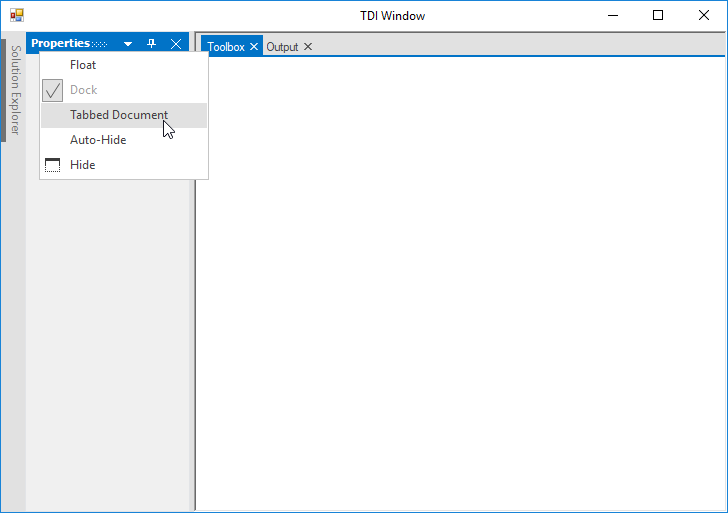
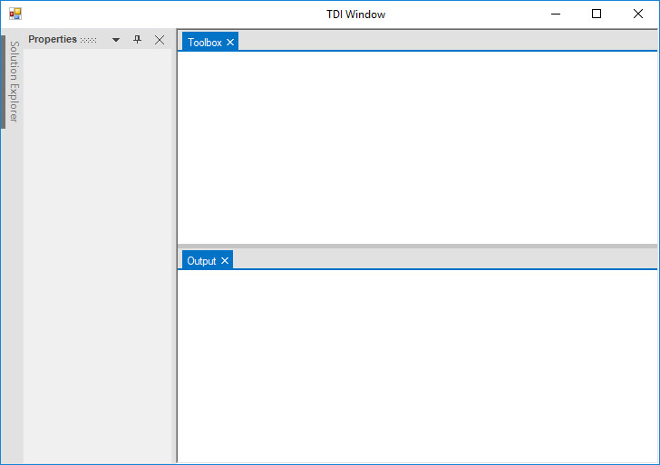
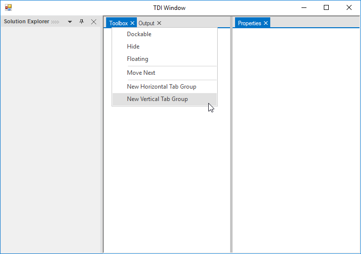
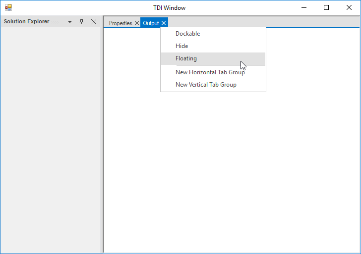
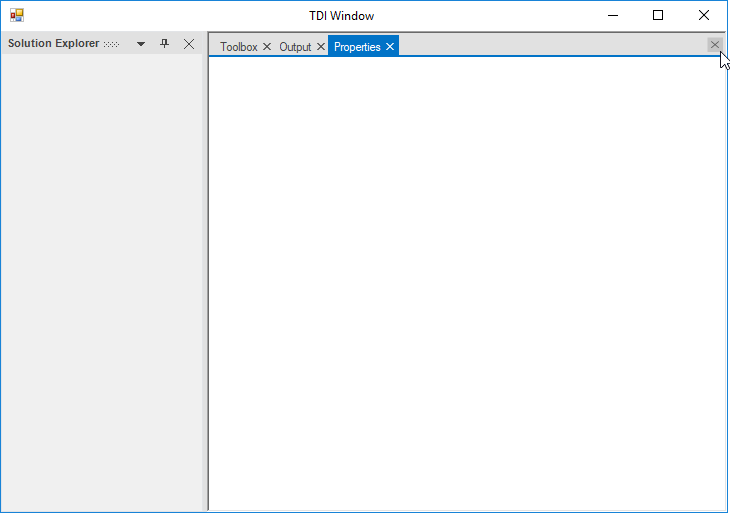
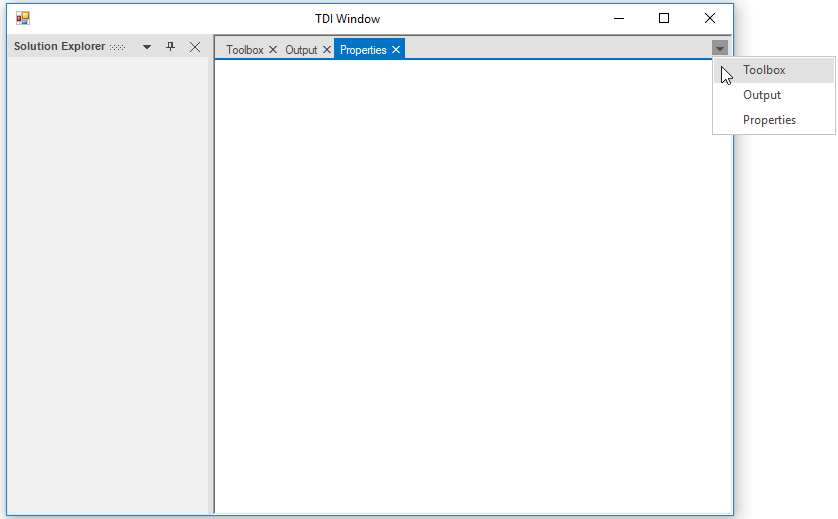

# TDI Window

Provides support for adding tabbed document windows in the docking manager. To enable document mode in docking manager, `EnableDocumentMode` property should be true.

## Add child view as tabbed document

`DockAsDocument` function helps to add the child window as document tab in docking manager. Document window should be added after dock layout is loaded. The `NewDockStateEndLoad` event is recommended to add tabbed documents in docking manager.





  // Invoking the NewDockStateEndLoad event.
   this.dockingManager1.NewDockStateEndLoad += DockingManager1_NewDockStateEndLoad

        private void DockingManager1_NewDockStateEndLoad(object sender, EventArgs e)
        {
          //To add TDI child 
            this.dockingManager1.DockAsDocument(this.panel1);
            this.dockingManager1.DockAsDocument(this.panel2);
        }





'Invoking the NewDockStateEndLoad event.
Me.dockingManager1.NewDockStateEndLoad += DockingManager1_NewDockStateEndLoad
 
Private Sub DockingManager1_NewDockStateEndLoad(ByVal sender As Object, ByVal e As EventArgs)

   'To add TDI child
			Me.dockingManager1.DockAsDocument(Me.panel1)
			Me.dockingManager1.DockAsDocument(Me.panel2)
      
		End Sub





 

 

## Document window behavior

`SetWindowMode` function helps to specify window mode of docking child that defines dockability for specific child in DockingManager. It specifies the docking child can dock as `Tool` window or `Document` window.

### Window Mode

* Tool - Tool window allows docking child to change its state as dock, float, auto-hidden, or MDI/TDI.

* Document - Document window allows docking child to move to float state alone and cannot be moved to dock or autohide state.





 //To set Docking child as Tool window mode

   this.dockingManager1.SetWindowMode(this.panel1, Syncfusion.Windows.Forms.Tools.WindowMode.Tool);





'To set Docking child as Tool window mode

Me.dockingManager1.SetWindowMode(this.panel1, Syncfusion.Windows.Forms.Tools.WindowMode.Tool)





 





//To set Docking child as Document window mode

this.dockingManager1.SetWindowMode(this.panel2,    Syncfusion.Windows.Forms.Tools.WindowMode.Document);





 'To set Docking child as Document window mode

 Me.dockingManager1.SetWindowMode(this.panel2,    Syncfusion.Windows.Forms.Tools.WindowMode.Document)





 

### Identify the control is Tool window or Document window

The `GetWindowMode` function of docking manager is used to determine window mode of docking child. This function takes the control as its argument and returns `WindowMode` whether the specified control is `Tool` or `Document`.





MessageBox.Show(this.dockingManager1.GetWindowMode(this.panel1).ToString());





 MessageBox.Show(this.dockingManager1.GetWindowMode(this.panel1).ToString());





## Freeze to document state

`FreezeToDocumentState` function helps to freeze the docking window state in Document and docking manager will not allows to move the child window to any other state.





this.dockingManager1.FreezeToDocumentState(panel1, true);

this.dockingManager1.FreezeToDocumentState(panel2, true);





Me.dockingManager1.FreezeToDocumentState(panel1, true)

Me.dockingManager1.FreezeToDocumentState(panel2, true)





### Identify the control is frozen to document state

The docking manager `IsFrozenToDocumentState` function is used to determine the frozen state of a document window. This function takes the control as its argument and returns true when the specified control is Frozen to document state. Otherwise, it returns false.





MessageBox.Show(this.dockingManager1.IsFrozenToDocumentState(this.panel1).ToString());





 MessageBox.Show(this.dockingManager1.IsFrozenToDocumentState(this.panel1).ToString());





## Create document tab groups

DockingManger allow to create document tab groups like Visual Studio. It can be grouped by using the options in context menu items.

 

## Tab group creation using context menu option

In docking manager, new tab group can be created at horizontal or vertical side in the document area using `ContextMenu` option.

 

 

## Disable tab group creation

Tab group creation can be enabled or disabled using the property `EnableTabGroup` of docking manager. To disable tab group creation, set `EnableTabGroup` as `False`. So, docking manager will not display “New Horizontal Tab Group” and “New Vertical Tab Group” context menu items when right click the document header.





//To disable Document tab group creation

this.dockingManager1.DocumentWindowSettings.EnableTabGroup = false;





'To disable Document tab group creation

Me.dockingManager1.DocumentWindowSettings.EnableTabGroup = false





## Move to dock state

TDI window can be moved to dock state by using dock menu item in contextMenu option.

 

## Move to float state

TDI window can be moved to float state by using floating menu item in contextMenu option. This can also be done by dragging its TDI tab header.

 

## Restricting document window dragging

Document tab window of docking manager can move to float state while dragging its tab header. This functionality can be enabled or disabled using the property `AllowDragging`. By default, its value is `true`.





//To disable document window dragging behavior

this.dockingManager1.DocumentWindowSettings.AllowDragging = false;





'To disable document window dragging behavior

Me.dockingManager1.DocumentWindowSettings.AllowDragging = false





## Document tab reordering

The docking manager allows to reorder the document tab by selecting and dragging to the desired index in document tab panel. Document tabs reordering behavior can be enabled or disabled using the `AllowTabsMoving` property. By default, its value is `true`.





// To restrict the document tabs reordering

this.dockingManager1.AllowTabsMoving = false;





'To restrict the document tabs reordering

Me.dockingManager1.AllowTabsMoving = false





## Show/Hide close button 

 The visibility of common close button to close the selected tab in document window can be changed by `ShowCloseButton` property. By default, its value is `false`.





// To show the common close button

 this.dockingManager1.DocumentWindowSettings.ShowCloseButton = true;





'To show the common close button

 Me.dockingManager1.DocumentWindowSettings.ShowCloseButton = true





 

## Show/Hide Tablist

The visibility of menu button that list all available document tabs in a drop-down list can be changed by `ShowTablist` property. By default, its value is `false`.





// To show  Tablist

  this.dockingManager1.DocumentWindowSettings.ShowTabList = true;





'To show  Tablist
 Me.dockingManager1.DocumentWindowSettings.ShowTabList = true





 