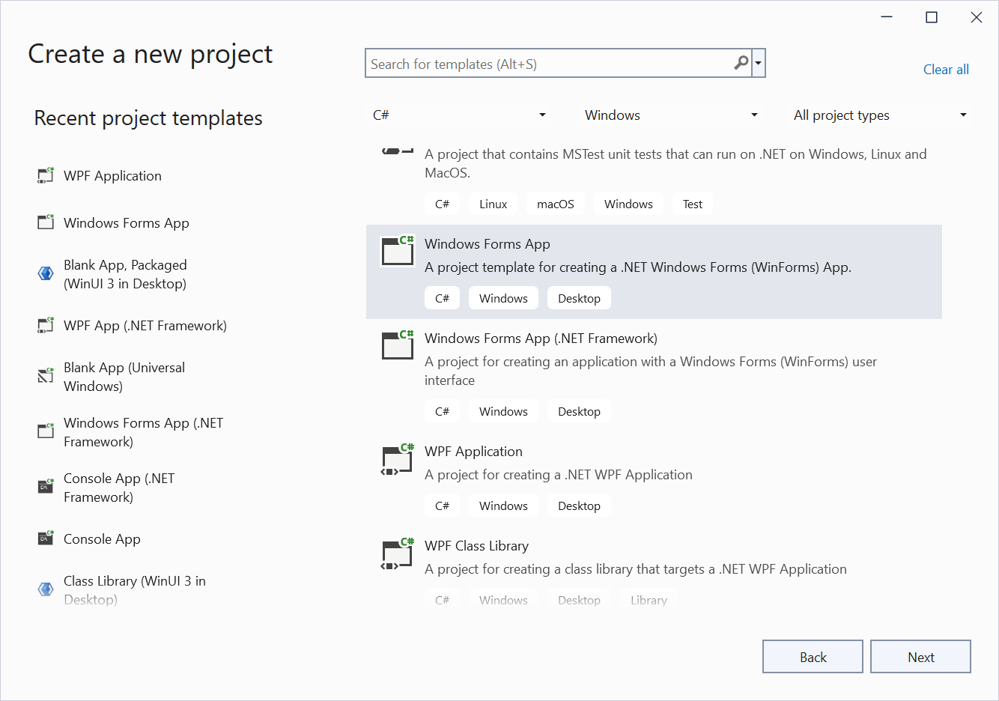
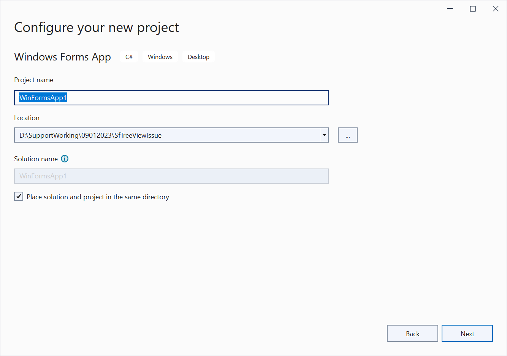
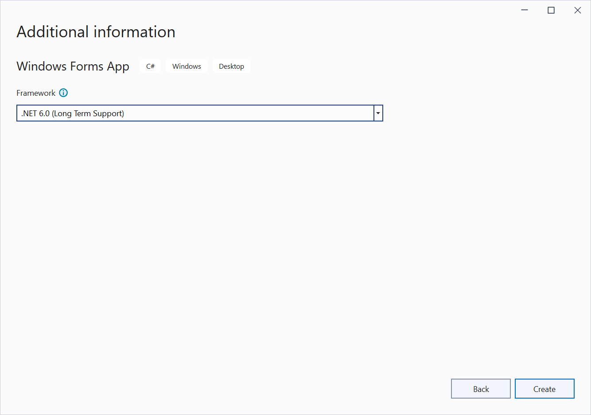
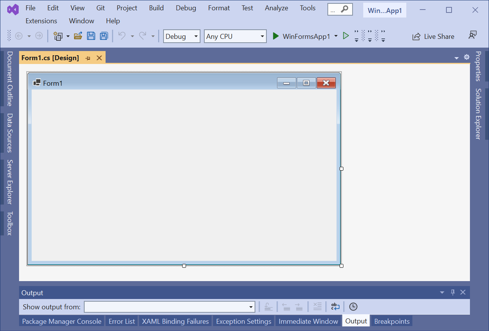
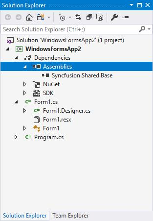
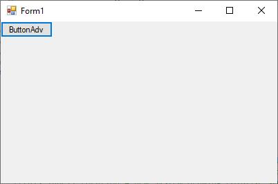

# WinForms Applications using .NET Core and Syncfusion WinForms Controls

Syncfusion Essential Studio for Windows Forms suits .NET core assemblies for building Windows Forms .NET Core applications using Syncfusion Controls. This section explains how to create the project in .NET Core application and using syncfusion Windows Forms controls.

N> All Syncfusion Windows Forms controls supports .NET Core Framework except the controls labeled as `classic`.

## Create a .NET Core project

**Step 1**: Open Visual Studio, go to **File > New > Project...** and you can now see **Create a new project** dialog. Here, select **Windows Forms App (.NET Core)** template and click **Next**. 

**Step 2**: You will now see **Configure your new project** dialog. Here, fill in the necessary details and click **Next**.

**Step 3**: In the Additional information window, select .NET 6.0 (Long-term support) for the Framework setting, and then click **Create**.

**Step 4**: Finally, Windows Forms (.NET Core) sample project is created.

**Step 5**: Now, you can add your controls. To do so, follow the immediate section **Adding controls in Windows Forms (.NET Core) application** for more details. 

## Adding controls in Windows Forms (.NET Core) application

The below section explains how to add your controls in Windows Forms (.NET Core) application.

### Through assembly deployment

In **Solution Explorer**, right-click on **Dependencies** and select **Add Reference**. 

Now, **Reference Manager** dialog will be opened. Here click **Browse** and select the needed assemblies from the location mentioned in below note section. On selecting necessary assemblies, click **Add** and then click **Ok**. Now, required assemblies are added in to the project, like in the below screenshot.

N> You can get Syncfusion Windows Forms (.NET Core) controls assemblies from `netcoreapp3.0` folder in the following location - C:\Program Files (x86)\Syncfusion\Essential Studio\Windows\x.x.x.x\precompiledassemblies

### Through NuGet Package

[Check here](https://help.syncfusion.com/windowsforms/installation/install-nuget-packages) to find more details regarding how to install the NuGet packages in Windows Forms application.  

### Example: Adding ButtonAdv control through code

We are now going to see a demo on how to add **ButtonAdv** control in WinForms .NET Core application.

**Step 1**:	Add the following dependent assembly for the inclusion of **ButtonAdv** control.

* Syncfusion.Shared.Base

**Step 2**: Create an instance of the control. Assign necessary properties with proper values and add the control instance to the form. 




ButtonAdv button = new ButtonAdv();
button.Text = ”ButtonAdv”;
this.controls.add(button);




**Step 3**: Run the application.

Refer [this](https://help.syncfusion.com/windowsforms/visual-studio-integration/toolbox-configuration#configuring-toolbox-for-windows-forms-net-5060-projects-from-nuget-packages) documentation link to configuring toolbox for Windows Forms .NET 6.0\8.0 projects from NuGet packages.