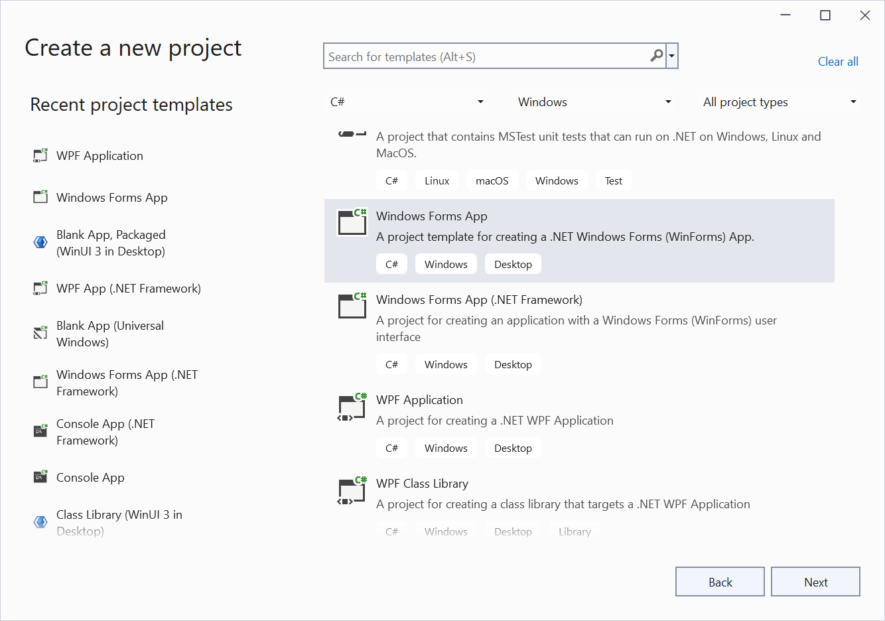
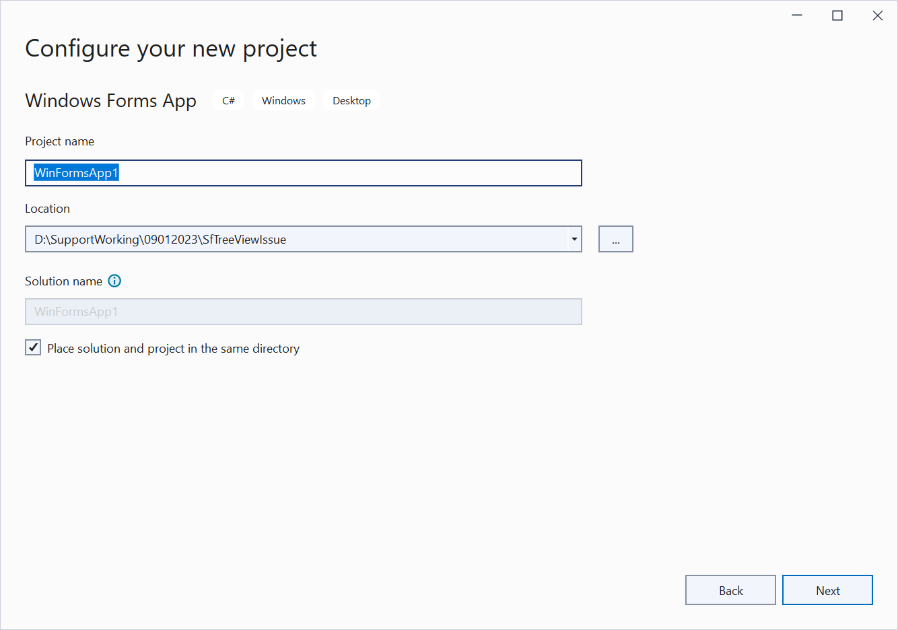
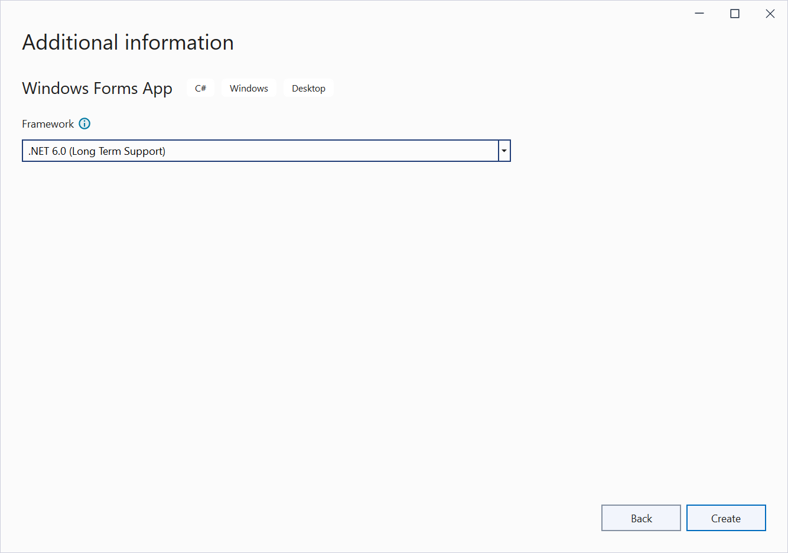
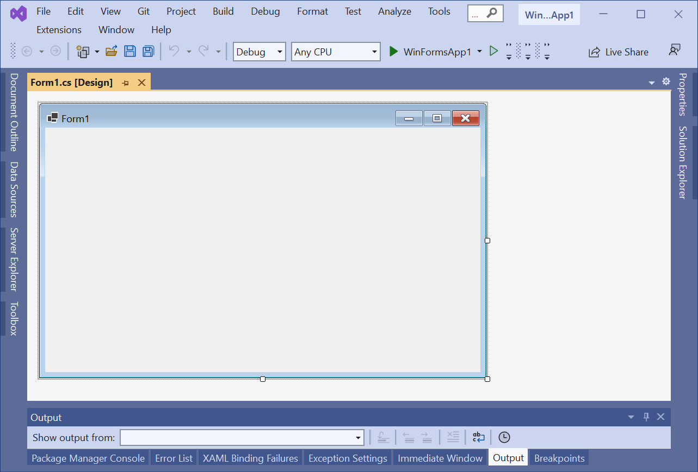
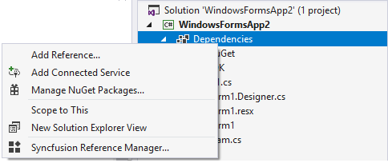
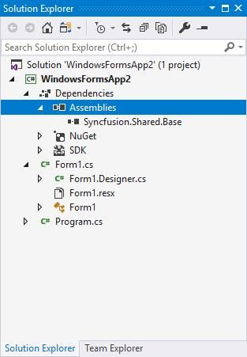
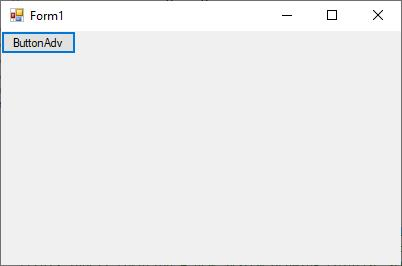

# WinForms Applications using .NET Core and Syncfusion® WinForms Controls

Syncfusion® Essential Studio® for Windows Forms provides .NET Core assemblies for building Windows Forms .NET Core applications using Syncfusion® controls. This section explains how to create the project in a .NET Core application and use Syncfusion® Windows Forms controls.

N> All Syncfusion® Windows Forms controls support .NET Core, except the controls in the Syncfusion `Classic` suite (such as ButtonAdv, ComboBoxAdv, ComboBoxAutoComplete, DateTimePickerAdv, GridDataBoundGrid, MonthCalendarAdv, and SuperTooltip). The Classic controls suite is listed in the [Controls list](https://help.syncfusion.com/windowsforms/overview) section of the WinForms overview.

## Prerequisites

Before creating a .NET Core project that uses Syncfusion® Windows Forms controls, complete the following setup:

* Install [Syncfusion® Essential Studio® Windows Forms](https://help.syncfusion.com/common/essential-studio/download) — this is required for assembly-based deployment and for the Visual Studio Toolbox to be populated with Syncfusion controls.
* Verify that your environment meets the [system requirements](https://help.syncfusion.com/windowsforms/system-requirements), including a supported version of Microsoft Visual Studio (Visual Studio 2019 or later is required for the .NET Core Windows Forms project templates).
* Make sure a valid Syncfusion® license key is available. Register the license key in your application startup (for example, in `Program.cs`) as shown below.






Syncfusion.Licensing.SyncfusionLicenseProvider.RegisterLicense("YOUR_LICENSE_KEY");





{{ codesnippet1 | OrderList_Indent_Level_1 }}

* If you are using NuGet packages, no Syncfusion installer is required. The required NuGet packages can be restored directly from [nuget.org](https://www.nuget.org/packages?q=Tags%3A%22Winforms%22+syncfusion).

## Version Compatibility

Syncfusion® Windows Forms .NET Core support is available for the supported .NET target frameworks as listed in the [system requirements](https://help.syncfusion.com/windowsforms/system-requirements).

> Refer to the Syncfusion® Windows Forms documentation for the latest supported target frameworks, package versions, and control compatibility.

## Create a .NET Core project

**Step 1**: Open Visual Studio (2019 or later), go to **File > New > Project...**. The **Create a new project** dialog appears. Select the **Windows Forms App (.NET)** template and click **Next**.

**Step 2**: The **Configure your new project** dialog appears. Fill in the following details and click **Next**:

* **Project name** — the name of the Windows Forms project.
* **Location** — the folder where the project will be created.
* **Solution name** — the name of the solution that contains the project.
* **Solution** — choose whether to create a new solution or add the project to an existing one.

**Step 3**: In the **Additional information** window, select a supported .NET target framework (for example, .NET 8.0 Long-term support) for the **Framework** setting, and then click **Create**.

**Step 4**: Finally, Windows Forms App (.NET Core) sample project is created.

**Step 5**: Now you can add Syncfusion® controls. Refer to the next section, **Adding Syncfusion Controls**, for more details.

## Assembly Location

The Syncfusion® Windows Forms .NET Core assemblies are available in the Syncfusion® Essential Studio® installation directory.

N> You can get Syncfusion® Windows Forms (.NET Core) control assemblies from the target-framework-specific folder (for example, `net6.0`, `net8.0`) under the following location:
>
> `C:\Program Files (x86)\Syncfusion\Essential Studio\Windows\<version>\precompiledassemblies`
>
> The `<version>` placeholder represents the installed Syncfusion® Essential Studio® version (for example, `26.1.35`). Pick the subfolder that matches the target framework of your project.

## Adding Syncfusion Controls

This section explains how to add Syncfusion® controls in a Windows Forms (.NET Core) application. Syncfusion® controls can be added either by referencing the assemblies from the local Syncfusion® install, or by installing Syncfusion® NuGet packages. NuGet is the recommended approach for most projects.

### Through assembly deployment

In **Solution Explorer**, right-click on **Dependencies** and select **Add Reference**.

The **Reference Manager** dialog opens. Click **Browse**, navigate to the Syncfusion® assembly folder documented in the [Assembly Location](#assembly-location) section, and select the assemblies required for the controls used in your application. Click **Add**, confirm that the assemblies appear in the **Selected** list, and then click **OK**.

N> Choose the subfolder that matches the target framework of your project (for example, `net6.0` for a project that targets .NET 6.0).

The required assemblies are added to the project, as shown in the following screenshot.

After adding the references, build the project to verify that the assemblies are resolved correctly.

### Through NuGet Package

The Syncfusion® Windows Forms NuGet packages are published on [nuget.org](https://www.nuget.org/packages?q=Tags%3A%22Winforms%22+syncfusion) and can be installed without a local Syncfusion® Essential Studio® installation.

#### Install using the Package Manager UI

1. Right-click the project in **Solution Explorer** and choose **Manage NuGet Packages...**.
2. Switch to the **Browse** tab and search for the Syncfusion® Windows Forms package required for the control you are using (for example, `Syncfusion.Shared.Base`).
3. Select the package, choose the version, and click **Install**.

#### Install using the Package Manager Console

Open the **Package Manager Console** (**Tools > NuGet Package Manager > Package Manager Console**) and run the following command:






Install-Package Syncfusion.Shared.Base





{{ codesnippet2 | OrderList_Indent_Level_1 }}

> The exact package name and version depend on the Syncfusion® control you are using. Refer to the [Control Dependencies](https://help.syncfusion.com/windowsforms/control-dependencies) topic for the package name required by each control, and the [Install Syncfusion® Windows Forms NuGet packages](https://help.syncfusion.com/windowsforms/installation/install-nuget-packages) topic for more install options.

## Code Example: Adding ButtonAdv

The following example shows how to add the **ButtonAdv** control to a Windows Forms (.NET Core) application using the [assembly deployment](#through-assembly-deployment) approach.

**Step 1**: Add the dependent assembly required for the **ButtonAdv** control:

* Syncfusion.Shared.Base

> For the full list of assemblies required by each control, refer to the [Control Dependencies](https://help.syncfusion.com/windowsforms/control-dependencies#buttonadv) topic. The exact assembly may vary based on the installed Syncfusion® version and the target framework.

**Step 2**: Add the required `using` directives in the form's code-behind file (for example, `Form1.cs`).






using System.Windows.Forms;
using Syncfusion.Windows.Forms;





{{ codesnippet3 | OrderList_Indent_Level_1 }}

**Step 3**: Create an instance of the **ButtonAdv** control, set its basic properties, and add it to the form. Place this code in the form constructor after `InitializeComponent()` or in the `Form_Load` event handler.






ButtonAdv button = new ButtonAdv();
button.Text = "ButtonAdv";
button.Location = new System.Drawing.Point(20, 20);
button.Size = new System.Drawing.Size(120, 30);
this.Controls.Add(button);





{{ codesnippet4 | OrderList_Indent_Level_1 }}

**Step 4**: Register your Syncfusion® license key (only required once per application), and then build and run the application.

## Configuring the Toolbox

After installing the Syncfusion® NuGet packages or assemblies, configure the Visual Studio Toolbox so the Syncfusion® controls can be dragged and dropped onto the form designer. Refer to the [Configuring the Toolbox for Windows Forms .NET projects from NuGet packages](https://help.syncfusion.com/windowsforms/visual-studio-integration/toolbox-configuration#configuring-toolbox-for-windows-forms-net-8-9-10-projects-from-nuget-packages) topic for the current step-by-step instructions, including the supported target framework versions.

## Deployment and Runtime Requirements

When publishing a Windows Forms (.NET Core) application that uses Syncfusion® controls, the target machine must have a compatible .NET (Core) runtime installed (for example, the .NET Desktop Runtime for the selected target framework). Refer to the [Deployment](https://help.syncfusion.com/windowsforms/deployment) topic and the [Microsoft .NET deployment documentation](https://learn.microsoft.com/en-us/dotnet/core/deploying/) for details.

## Troubleshooting

| Issue | Possible cause | Suggested fix |
|---|---|---|
| `FileNotFoundException` for `Syncfusion.Shared.Base` or another Syncfusion assembly at runtime | The required assembly or NuGet package is not referenced in the project. | Add the missing reference as described in [Adding Syncfusion Controls](#adding-syncfusion-controls) and rebuild. |
| Controls render with an evaluation watermark | The Syncfusion® license key is not registered. | Call `Syncfusion.Licensing.SyncfusionLicenseProvider.RegisterLicense("YOUR_LICENSE_KEY")` at application startup. |
| `Could not load file or assembly` targeting a different framework | The referenced assembly's target framework does not match the project. | Pick the subfolder that matches the project target framework (for example, `net6.0` for a .NET 6.0 project). |
| Syncfusion® tab is not visible in the Visual Studio Toolbox | The Syncfusion® Toolbox configuration was not run, or the Syncfusion® installer was not used. | Refer to the [Configuring the Toolbox](#configuring-the-toolbox) section. |

## See Also

* [Add Syncfusion® Windows Forms Controls](https://help.syncfusion.com/windowsforms/add-syncfusion-controls)
* [Install Syncfusion® Windows Forms NuGet packages](https://help.syncfusion.com/windowsforms/installation/install-nuget-packages)
* [Control Dependencies](https://help.syncfusion.com/windowsforms/control-dependencies)
* [Configuring the Toolbox for Windows Forms .NET projects](https://help.syncfusion.com/windowsforms/visual-studio-integration/toolbox-configuration)
* [Deployment](https://help.syncfusion.com/windowsforms/deployment)
* [System Requirements](https://help.syncfusion.com/windowsforms/system-requirements)
* [Licensing Overview](https://help.syncfusion.com/common/essential-studio/licensing/overview)
* [Syncfusion® Windows Forms Overview](https://help.syncfusion.com/windowsforms/overview)