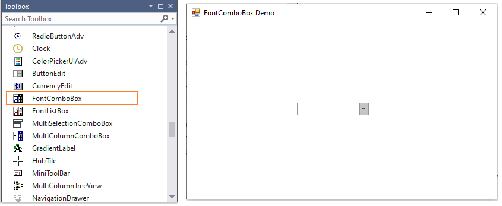
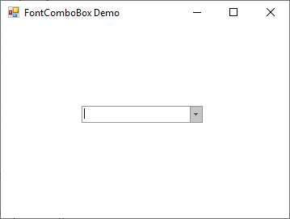
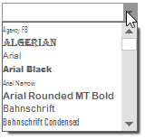
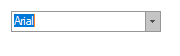

# Getting Started with Windows Forms FontComboBox

This section briefly describes how to create a new Windows Forms project in Visual Studio and add the [FontComboBox](https://help.syncfusion.com/cr/windowsforms/Syncfusion.Windows.Forms.Tools.FontComboBox.html) control with its functionalities.

## Assembly Deployment

Refer [Control dependencies](https://help.syncfusion.com/windowsforms/control-dependencies#fontcombobox) section to get the list of assemblies or NuGet package needs to be added as reference to use the FontComboBox in any application.

You can find more details about installing the NuGet packages in a Windows Forms application in the following link:

[How to install nuget packages](https://help.syncfusion.com/windowsforms/installation/install-nuget-packages)

## Creating Application with FontComboBox

In this walk through, users will create WinForms Application that contains `FontComboBox` control.

### Creating the Project

Create new Windows Forms Project in Visual Studio to display FontComboBox with font items.

## Adding FontCombobox Control via Designer

The FontComboBox control can be added to the application by dragging it from Toolbox and dropping it in designer. The required assembly reference will br added automatically.

## Adding FontComboBox control via code

In order to add FontComboBox control manually, do the below steps,

1. Add the required [assembly references](https://help.syncfusion.com/windowsforms/control-dependencies#fontcombobox) to the project.

2. Create the FontComboBox control instance and add it to the form.





FontComboBox fontComboBox = new FontComboBox();
fontComboBox.Size = new Size(150, 40);
fontComboBox.Location = new Point(100, 100);
this.Controls.Add(fontComboBox);





Dim fontComboBox As New FontComboBox()
fontComboBox.Size = New Size(150, 40)
fontComboBox.Location = New Point(100, 100)
Me.Controls.Add(fontComboBox)




{{ codesnippet1 | OrderList_Indent_Level_1 }} 

## AutoComplete setting

The default font items in the FontComboBox control can be loaded by using the [UseAutoComplete](https://help.syncfusion.com/cr/windowsforms/Syncfusion.Windows.Forms.Tools.FontComboBox.html#Syncfusion_Windows_Forms_Tools_FontComboBox_UseAutoComplete) property.





fontComboBox.UseAutoComplete = true;





fontComboBox.UseAutoComplete = True





## Selection

You can programmatically select the item or index by using the [SelectedItem](https://learn.microsoft.com/en-us/dotnet/api/system.windows.forms.combobox.selecteditem?view=windowsdesktop-7.0&viewFallbackFrom=netcore-3.1) or [SelectedIndex](https://learn.microsoft.com/en-us/dotnet/api/system.windows.forms.combobox.selectedindex?view=windowsdesktop-7.0&viewFallbackFrom=netcore-3.1) properties in FontComboBox control.





//Select the item using SelectedItem property.
fontComboBox.SelectedItem = "Arial";

//Select the index using SelectedIndex property.
fontComboBox.SelectedIndex = 1;





'Select the item using SelectedItem property.
fontComboBox.SelectedItem = "Arial"

'Select the index using SelectedIndex property.
fontComboBox.SelectedIndex = 1





N> [View sample in GitHub](https://github.com/SyncfusionExamples/GettingStarted-WF-FontComboBox)

## RTL support

RTL is used to display the content from right to left by setting the [RightToLeft](https://learn.microsoft.com/en-us/dotnet/api/system.windows.forms.control.righttoleft?view=windowsdesktop-7.0&viewFallbackFrom=netcore-3.1) property to `Yes`.





fontComboBox.RightToLeft = RightToLeft.Yes;





fontComboBox.RightToLeft = RightToLeft.Yes





