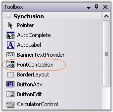
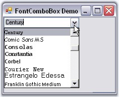

# Getting Started with Windows Forms FontComboBox

To use a FontComboBox control in your application, all you need to do is drag and drop the FontComboBox control from the controls toolbox onto your form. 

It can be created programmatically as follows.

1. Include the required namespace. 




using Syncfusion.Windows.Forms.Tools;





Imports Syncfusion.Windows.Forms.Tools




2. Create an instance of FontComboBox control. Specify its size and finally add that instance to that Form.




private Syncfusion.Windows.Forms.Tools.FontComboBox fontComboBox1;
this.fontComboBox1=new Syncfusion.Windows.Forms.Tools.FontComboBox();
this.fontComboBox1.Size = new System.Drawing.Size(152, 21);
this.Controls.Add(this.fontComboBox1);





Private fontComboBox1 As Syncfusion.Windows.Forms.Tools.FontComboBox
Me.fontComboBox1 = New Syncfusion.Windows.Forms.Tools.FontComboBox()
Me.fontComboBox1.Size = New System.Drawing.Size(152, 21)
Me.Controls.Add(Me.fontComboBox1)




 