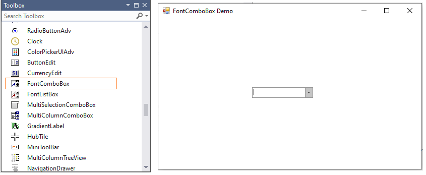
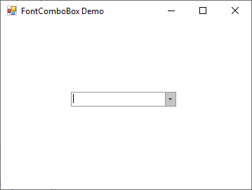
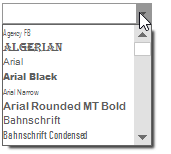

# Getting Started with Windows Forms FontComboBox

This section briefly describes how to create a new Windows Forms project in Visual Studio and add the [FontComboBox](https://help.syncfusion.com/cr/windowsforms/Syncfusion.Windows.Forms.Tools.FontComboBox.html) control with its functionalities.

## Assembly Deployment

Refer to the [Control dependencies](https://help.syncfusion.com/windowsforms/control-dependencies#fontcombobox) section to get the list of assemblies and NuGet packages needed to be added as a reference to use the FontComboBox in any application.

You can find more details about installing the NuGet packages in a Windows Forms application from the following link:

[How to install NuGet packages](https://help.syncfusion.com/windowsforms/installation/install-nuget-packages)

To install the required Syncfusion.Editors.WinForms NuGet package via the Package Manager Console, run the following command:

```powershell
Install-Package Syncfusion.Editors.WinForms
```

## Adding FontComboBox via Designer

1. Create a new Windows Forms project in Visual Studio.

2. Add the [FontComboBox](https://help.syncfusion.com/cr/windowsforms/Syncfusion.Windows.Forms.Tools.FontComboBox.html) control to the application by dragging it from the Toolbox and dropping it in the designer. The following dependent assemblies will be added automatically:

    * Syncfusion.Tools.Windows
    * Syncfusion.Shared.Base
    * Syncfusion.Tools.Base
    * Syncfusion.Grid.Base
    * Syncfusion.Shared.Windows
    * Syncfusion.Grid.Windows
    * Syncfusion.SpellChecker.Base



## Adding FontComboBox via Code

In order to add the FontComboBox control manually, do the steps below. Place the code inside the form's constructor or the form `Load` event handler.

1. Add the following assembly references to the project:

    * Syncfusion.Tools.Windows
    * Syncfusion.Shared.Base
    * Syncfusion.Tools.Base
    * Syncfusion.Grid.Base
    * Syncfusion.Shared.Windows
    * Syncfusion.Grid.Windows
    * Syncfusion.SpellChecker.Base

2. Import the `Syncfusion.Windows.Forms.Tools` namespace.
3. Create the FontComboBox control instance and add it to the form.





using System.Drawing;
using System.Windows.Forms;
using Syncfusion.Windows.Forms.Tools;

public partial class Form1 : Form
{
    private FontComboBox fontComboBox;

    public Form1()
    {
        InitializeComponent();

        fontComboBox = new FontComboBox();
        fontComboBox.Size = new Size(150, 40);
        fontComboBox.Location = new Point(100, 100);
        this.Controls.Add(fontComboBox);
    }
}




Imports System.Drawing
Imports System.Windows.Forms
Imports Syncfusion.Windows.Forms.Tools

Public Partial Class Form1
    Inherits Form

    Private fontComboBox As FontComboBox

    Public Sub New()
        InitializeComponent()

        fontComboBox = New FontComboBox()
        fontComboBox.Size = New Size(150, 40)
        fontComboBox.Location = New Point(100, 100)
        Me.Controls.Add(fontComboBox)
    End Sub
End Class




{{ codesnippet1 | OrderList_Indent_Level_1 }} 



## AutoComplete

The font items populated in the FontComboBox control can be filtered as you type by using the [UseAutoComplete](https://help.syncfusion.com/cr/windowsforms/Syncfusion.Windows.Forms.Tools.FontComboBox.html#Syncfusion_Windows_Forms_Tools_FontComboBox_UseAutoComplete) property. The default value is `false`; set it to `true` to enable automatic completion based on the installed system fonts.




fontComboBox.UseAutoComplete = true;




fontComboBox.UseAutoComplete = True






## Selection

You can programmatically select a font by name or by position in the list using the [SelectedItem](https://learn.microsoft.com/en-us/dotnet/api/system.windows.forms.combobox.selecteditem) or [SelectedIndex](https://learn.microsoft.com/en-us/dotnet/api/system.windows.forms.combobox.selectedindex) properties on the FontComboBox control.




//Select the item using SelectedItem property.
fontComboBox.SelectedItem = "Arial";
//Select the index using SelectedIndex property.
fontComboBox.SelectedIndex = 1;




'Select the item using SelectedItem property.
fontComboBox.SelectedItem = "Arial"
'Select the index using SelectedIndex property.
fontComboBox.SelectedIndex = 1





N> [View sample in GitHub](https://github.com/SyncfusionExamples/GettingStarted-WF-FontComboBox)

## RTL support

By default, the FontComboBox control renders its content from left to right. Use the [RightToLeft](https://learn.microsoft.com/en-us/dotnet/api/system.windows.forms.control.righttoleft) property to render the control for right-to-left languages. Valid values are `No`, `Yes`, and `Inherit`.




fontComboBox.RightToLeft = RightToLeft.Yes;




fontComboBox.RightToLeft = RightToLeft.Yes





