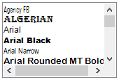
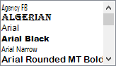

## Selection Mode

At run time, the items in the FontListBox can be selected based on the selection mode specified in the [SelectionMode](https://learn.microsoft.com/en-us/dotnet/api/system.windows.forms.listbox.selectionmode?redirectedfrom=MSDN&view=netframework-4.8#System_Windows_Forms_ListBox_SelectionMode) property. Selection can be made using mouse and keyboard.

The FontListBox contains the following options:

* one
* MultiSimple 
* MultiExtended




this.fontListBox1.SelectionMode = System.Windows.Forms.SelectionMode.MultiExtended;





Me.fontListBox1.SelectionMode = System.Windows.Forms.SelectionMode.MultiExtended




 

## ScrollBar settings

By default, the [FontListBox](https://help.syncfusion.com/cr/windowsforms/Syncfusion.Windows.Forms.Tools.FontListBox.html) control has a vertical scrollbar. It can also contain a horizontal scrollbar. This section explains the properties that sets the scrollbar to the control.

### Horizontal scrollbar

The [HorizontalScrollbar](https://learn.microsoft.com/en-us/dotnet/api/system.windows.forms.listbox.horizontalscrollbar?view=netframework-4.8) can be displayed if the items are beyond the right edge of the FontListBox.

<table>
<tr>
<th>
Properties</th><th>
Description</th></tr>
<tr>
<td>
HorizontalScrollbar</td><td>
Sets the horizontal scrollbar for the control if the item exceeds beyond the right edge of the FontListBox control.</td></tr>
<tr>
<td>
HorizontalExtent</td><td>
Specifies the width of the control when the HorizontalScrollBar property is set to true.</td></tr>
</table>




this.fontListBox1.HorizontalExtent = 150;
this.fontListBox1.HorizontalScrollbar = true;





Me.fontListBox1.HorizontalExtent = 150
Me.fontListBox1.HorizontalScrollbar = True






[How to display the scrollbars always irrespective of the number of items?](/windowsforms/fontlistbox/faq/how-to-display-the-scrollbars-always-irrespective-of-the-number-of-items)



## FontListBox items

### Height

We can set the height of the item inside the listbox through [ItemHeight](https://learn.microsoft.com/en-us/dotnet/api/system.windows.forms.listbox.itemheight?view=netframework-4.8) property. Default value is 15. 




this.fontListBox1.ItemHeight = 20;





Me.fontListBox1.ItemHeight = 20


 

 

### Sorting

Sorting of the items can be enabled using the [Sorted](https://learn.microsoft.com/en-us/dotnet/api/system.windows.forms.listbox.sorted?view=netframework-4.8) property. By default, the value of this property is false.




this.fontListBox1.Sorted = true;





Me.fontListBox1.Sorted = True




### AutoCompleting the items

The **FontListBox** control has the ability to auto complete the items as you type in the list box. This feature is enabled by setting the [UseAutoComplete](https://help.syncfusion.com/cr/windowsforms/Syncfusion.Windows.Forms.Tools.FontListBox.html#Syncfusion_Windows_Forms_Tools_FontListBox_UseAutoComplete) property to true.




this.fontListBox1.UseAutoComplete = true;





Me.fontListBox1.UseAutoComplete = True




## Events

The SelectedIndexChanged event occurs when the ListBox.SelectedIndex property is changed.

The following code snippet allows you to set a selected font style for a label on selecting through a FontListBox using the [SelectedIndexChanged](https://learn.microsoft.com/en-us/dotnet/api/system.windows.forms.listbox.selectedindexchanged?redirectedfrom=MSDN&view=netframework-4.8) event.




private void fontListBox1_SelectedIndexChanged(object sender, EventArgs e)
{
    this.label1.Font = new Font(this.fontListBox1.SelectedItem.ToString(), 11, FontStyle.Regular);
}





Private Sub fontListBox1_SelectedIndexChanged(ByVal sender As Object, ByVal e As EventArgs)
    Me.label1.Font = New Font(Me.fontListBox1.SelectedItem.ToString(), 11, FontStyle.Regular)
End Sub



