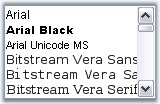
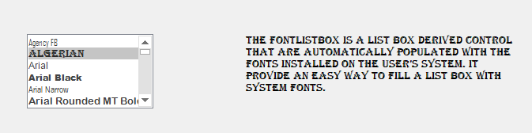

# Getting Started

This section briefly describes how to create a new Windows Forms project in Visual Studio and add **FontListBox** with its basic functionalities.

## Assembly deployment

Refer to the [Control Dependencies](https://help.syncfusion.com/windowsforms/control-dependencies#fontlistbox) section to get the list of assemblies or details of NuGet package that needs to be added as reference to use the control in any application.

Click [NuGet Packages](https://help.syncfusion.com/windowsforms/visual-studio-integration/nuget-packages) to learn how to install nuget packages in Windows Forms application.

## Adding the FontListBox control via designer

The FontListBox control can be added via designer by following steps:

1) Create a new Windows Forms application in Visual Studio.

2) The [FontListBox](https://help.syncfusion.com/cr/windowsforms/Syncfusion.Tools.Windows~Syncfusion.Windows.Forms.Tools.FontListBox.html) control can be added to an application by dragging it from the toolbox to design view. The following dependent assemblies will be added automatically:

* Syncfusion.Grid.Base
* Syncfusion.Grid.Windows
* Syncfusion.Shared.Base
* Syncfusion.Shared.Windows
* Syncfusion.Tools.Base
* Syncfusion.Tools.Windows

  

## Adding the FontListBox control via code

The following steps illustrate how to create a FontListBox control programmatically:

1) Create C# or VB application via Visual Studio.

2) Add the following assembly references to the project:

* Syncfusion.Grid.Base
* Syncfusion.Grid.Windows
* Syncfusion.Shared.Base
* Syncfusion.Shared.Windows
* Syncfusion.Tools.Base
* Syncfusion.Tools.Windows

3) Include the required namespace.




using Syncfusion.Windows.Forms.Tools;





Imports Syncfusion.Windows.Forms.Tools
 



4) Create an instances of [FontListBox](https://help.syncfusion.com/cr/windowsforms/Syncfusion.Tools.Windows~Syncfusion.Windows.Forms.Tools.FontListBox.html) control, specify its size, and add it to the Form.





FontListBox fontListBox1 = new FontListBox();
fontListBox1.Size = new System.Drawing.Size(160, 94);
this.Controls.Add(fontListBox1);





Dim fontListBox1 As New FontListBox()
fontListBox1.Size = New System.Drawing.Size(160, 94)
Me.Controls.Add(fontListBox1)





## Selected items

At run time, the items in the **FontListBox** can be selected. The text style will be changed based on the select the font item from the FontListBox.





// For Label control
Label label = new Label();
label.Anchor = System.Windows.Forms.AnchorStyles.None;
label.FlatStyle = System.Windows.Forms.FlatStyle.Flat;
label.Font = new System.Drawing.Font("Microsoft Sans Serif", 9.75F);
label.Location = new System.Drawing.Point(430, 83);
label.Size = new System.Drawing.Size(346, 95);
label.Text = "The FontListBox is a list box derived control that are automatically populated wi" +
                    "th the fonts installed on the user’s system. It provide an easy way to fill a li" +
                    "st box with system fonts.";

// Add the control
this.Controls.Add(label);

// Add selection event for control
fontListBox1.SelectedIndexChanged += new System.EventHandler(this.FontListBox1_SelectedIndexChanged);

// Selection event for FontListBox
private void FontListBox1_SelectedIndexChanged(object sender, System.EventArgs e)
{
    this.label2.Font = new System.Drawing.Font(this.fontListBox1.SelectedItem.ToString(), 10, System.Drawing.FontStyle.Regular);    
}





' For Label control
Private label As New Label()
label.Anchor = System.Windows.Forms.AnchorStyles.None
label.FlatStyle = System.Windows.Forms.FlatStyle.Flat
label.Font = New System.Drawing.Font("Microsoft Sans Serif", 9.75F)
label.Location = New System.Drawing.Point(430, 83)
label.Size = New System.Drawing.Size(346, 95)
label.Text = "The FontListBox is a list box derived control that are automatically populated wi" & "th the fonts installed on the user’s system. It provide an easy way to fill a li" & "st box with system fonts."

' Add the control
Me.Controls.Add(Me.label)

' Add selection event for control
AddHandler fontListBox1.SelectedIndexChanged, AddressOf FontListBox1_SelectedIndexChanged

' Selection event for FontListBox
private void FontListBox1_SelectedIndexChanged(Object sender, System.EventArgs e)
	Me.label2.Font = New System.Drawing.Font(Me.fontListBox1.SelectedItem.ToString(), 10, System.Drawing.FontStyle.Regular)





## Selection

At run time, the items in the [FontListBox](https://help.syncfusion.com/cr/windowsforms/Syncfusion.Tools.Windows~Syncfusion.Windows.Forms.Tools.FontListBox.html) can be selected, based on the selection mode specified in [SelectionMode](https://docs.microsoft.com/en-us/dotnet/api/system.windows.forms.listbox.selectionmode?redirectedfrom=MSDN&view=netframework-4.8#System_Windows_Forms_ListBox_SelectionMode) property. Selection can be made using mouse as well as using keyboard.

The options are,

* One
* MultiSimple
* MultiExtended





fontListBox1.SelectionMode = System.Windows.Forms.SelectionMode.MultiExtended;





fontListBox1.SelectionMode = System.Windows.Forms.SelectionMode.MultiExtended





