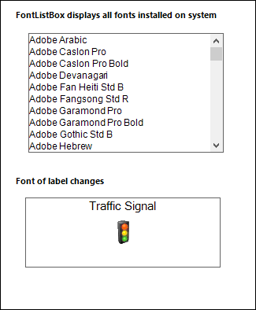

# Overview

The **FontListBox** is a list box derived control that are automatically populated with the fonts installed on the user's system. It provide an easy way to fill a list box with system fonts. 

## Key Features

**Selection mode** - Provides different modes of selection. The options are One, MultiSimple and MultiExtended.

**Themes** - Supports set of visual styles to customize the look and feel of FontListBox control.
