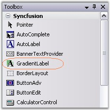

# Getting Started

The GradientLabel control can be created in the following ways.

## Through Designer

To create a GradientLabel control through designer,

* Create or open a Windows Forms project.
* Add a GradientLabel Control from the toolbox onto the form by dragging and dropping it on the form or double clicking the control.

   

* Set the desired properties for the control through theProperty grid.
* Run the application.

   



[Through Code](#through-code)



## Through Code

GradientLabel can be created programmatically as detailed below.

*  Create a C# or VB.NET application though Visual Studio.
*  Add the required assembly references.
*  Include the required namespace.




using Syncfusion.Windows.Forms.Tools;





Imports Syncfusion.Windows.Forms.Tools




*  Declare the GradientLabel control.




private Syncfusion.Windows.Forms.Tools.GradientLabel gradientLabel1;
		




Private gradientLabel1 As Syncfusion.Windows.Forms.Tools.GradientLabel




*  Initialize the control.




this.gradientLabel1 = new Syncfusion.Windows.Forms.Tools.GradientLabel();





Me.gradientLabel1 = New Syncfusion.Windows.Forms.Tools.GradientLabel()




*  Set the properties for the GradientLabel control and add it to your form.




this.gradientLabel1.BorderStyle = System.Windows.Forms.Border3DStyle.Sunken;
this.gradientLabel1.ForeColor = System.Drawing.SystemColors.Info;
this.gradientLabel1.Text = "Syncfusion Control";

// Add the GradientLabel control to the Form.
this.Controls.Add(this.gradientLabel1);
		




Me.gradientLabel1.BorderStyle = System.Windows.Forms.Border3DStyle.Sunken
Me.gradientLabel1.ForeColor = System.Drawing.SystemColors.Info
Me.gradientLabel1.Text = "Syncfusion Control"

' Add the GradientLabel control to the Form.
Me.Controls.Add(Me.gradientLabel1)




* Run the application.

   
