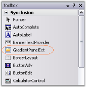
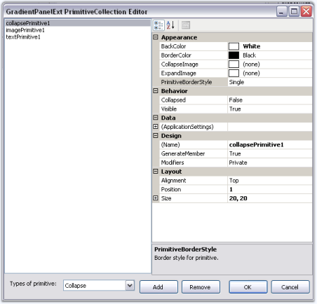
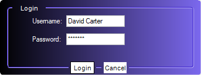

# Getting Started with Windows Forms GradientPanelExt

This section briefly describes how to create a new Windows Forms project in Visual Studio and add the **GradientPanelExt** control with its basic functionalities.

## Assembly deployment

Refer to the [Control Dependencies](https://help.syncfusion.com/windowsforms/control-dependencies#gradientpanelext) section to get the list of assemblies or the NuGet package details that must be referenced to use the control in any application.

Refer to [NuGet Packages](https://help.syncfusion.com/windowsforms/installation/install-nuget-packages) to learn how to install NuGet packages in a Windows Forms application.

To install via the NuGet Package Manager Console, run:

```powershell
Install-Package Syncfusion.Shared.Base
```

## Adding GradientPanelExt control via designer

1. Create a new Windows Forms project in Visual Studio.

2. Install the Syncfusion WinForms NuGet package so the control is registered in the toolbox, then drag the [GradientPanelExt](https://help.syncfusion.com/cr/windowsforms/Syncfusion.Windows.Forms.Tools.GradientPanelExt.html) from the toolbox to the designer surface. The following dependent assembly is added automatically:

    * Syncfusion.Shared.Base



3. Configure the panel through the property grid. For example:

    * Set `BackgroundColor` to a `Syncfusion.Drawing.BrushInfo` value with the desired gradient style.
    * Set `BorderColor` and `BorderStyle` to customize the border.
    * Set `CornerRadius` to round the corners.

4. Add primitives using the **GradientPanelExt Primitive Collection Editor** accessed through the [Primitives](https://help.syncfusion.com/cr/windowsforms/Syncfusion.Windows.Forms.Tools.GradientPanelExt.html#Syncfusion_Windows_Forms_Tools_GradientPanelExt_Primitives) property. Choose the primitive type from the editor (Collapse, Image, Text, or Host) and set its alignment, position, and size in the property grid.



5. Build and run the application.

## Adding GradientPanelExt control via code

The following steps describe how to create the **GradientPanelExt** control programmatically.

1. Create a C# or VB.NET application in Visual Studio.

2. Add the following assembly reference to the project:

    * Syncfusion.Shared.Base

3. Include the required namespaces at the top of the file.





using Syncfusion.Windows.Forms.Tools;
using Syncfusion.Drawing;
using System.Drawing;
using System.Windows.Forms;




Imports Syncfusion.Windows.Forms.Tools
Imports Syncfusion.Drawing
Imports System.Drawing
Imports System.Windows.Forms




{{ codesnippet1 | OrderList_Indent_Level_1 }}

4. Create an instance of the [GradientPanelExt](https://help.syncfusion.com/cr/windowsforms/Syncfusion.Windows.Forms.Tools.GradientPanelExt.html), and add it to the form.





GradientPanelExt gradientPanelExt = new GradientPanelExt();
this.Controls.Add(gradientPanelExt);




Dim gradientPanelExt As New GradientPanelExt()
Me.Controls.Add(gradientPanelExt)




{{ codesnippet2 | OrderList_Indent_Level_1 }}

5. Add properties, add primitives, and add the control. Place the following code inside the `Form1` class.





public partial class Form1 : Form
{
    private Syncfusion.Windows.Forms.Tools.GradientPanelExt gradientPanelExt;

    public Form1()
    {
        InitializeComponent();

        // GradientPanelExt
        gradientPanelExt = new Syncfusion.Windows.Forms.Tools.GradientPanelExt();
        gradientPanelExt.Name = "gradientPanelExt";
        gradientPanelExt.Size = new System.Drawing.Size(343, 128);
        gradientPanelExt.Location = new System.Drawing.Point(20, 20);
        gradientPanelExt.BackColor = System.Drawing.Color.Transparent;
        gradientPanelExt.BackgroundColor = new Syncfusion.Drawing.BrushInfo(
            Syncfusion.Drawing.GradientStyle.Horizontal,
            System.Drawing.Color.MediumSlateBlue,
            System.Drawing.Color.Lavender);
        gradientPanelExt.CornerRadius = 10;
        this.Controls.Add(gradientPanelExt);

        // Username Label
        Label label1 = new Label();
        label1.Location = new System.Drawing.Point(52, 29);
        label1.BackColor = System.Drawing.Color.Transparent;
        label1.ForeColor = System.Drawing.Color.White;
        label1.Size = new System.Drawing.Size(58, 13);
        label1.Text = "Username:";

        // Password Label
        Label label2 = new Label();
        label2.Location = new System.Drawing.Point(52, 60);
        label2.BackColor = System.Drawing.Color.Transparent;
        label2.ForeColor = System.Drawing.Color.White;
        label2.Size = new System.Drawing.Size(58, 13);
        label2.Text = "Password:";

        // Username TextBoxExt
        TextBoxExt textBoxExt1 = new TextBoxExt();
        textBoxExt1.Location = new System.Drawing.Point(113, 26);
        textBoxExt1.Size = new System.Drawing.Size(100, 20);
        textBoxExt1.Text = "David carter";

        // Password TextBoxExt
        TextBoxExt textBoxExt2 = new TextBoxExt();
        textBoxExt2.Location = new System.Drawing.Point(113, 57);
        textBoxExt2.PasswordChar = '*';
        textBoxExt2.Size = new System.Drawing.Size(100, 20);
        textBoxExt2.Text = "Welcome";

        // Login title primitive
        TextPrimitive textPrimitive1 = new TextPrimitive();
        textPrimitive1.Text = "Login";
        textPrimitive1.TextColor = System.Drawing.Color.White;
        textPrimitive1.Alignment = Syncfusion.Windows.Forms.Tools.Alignment.Top;
        textPrimitive1.BorderColor = System.Drawing.Color.Transparent;
        textPrimitive1.Size = new System.Drawing.Size(50, 20);

        // Ok button primitive
        TextPrimitive textPrimitive2 = new TextPrimitive();
        textPrimitive2.Text = "Ok";
        textPrimitive2.BackColor = System.Drawing.Color.White;
        textPrimitive2.TextColor = System.Drawing.Color.Black;
        textPrimitive2.Alignment = Syncfusion.Windows.Forms.Tools.Alignment.Bottom;
        textPrimitive2.BorderColor = System.Drawing.Color.Transparent;
        textPrimitive2.Position = 104;
        textPrimitive2.Size = new System.Drawing.Size(40, 20);

        // Cancel button primitive
        TextPrimitive textPrimitive3 = new TextPrimitive();
        textPrimitive3.Text = "Cancel";
        textPrimitive3.BackColor = System.Drawing.Color.White;
        textPrimitive3.TextColor = System.Drawing.Color.Black;
        textPrimitive3.Alignment = Syncfusion.Windows.Forms.Tools.Alignment.Bottom;
        textPrimitive3.BorderColor = System.Drawing.Color.Transparent;
        textPrimitive3.Position = 160;
        textPrimitive3.Size = new System.Drawing.Size(40, 20);

        // Add primitives to the panel
        gradientPanelExt.Primitives.AddRange(new Syncfusion.Windows.Forms.Tools.Primitive[] {
            textPrimitive1,
            textPrimitive2,
            textPrimitive3 });

        // Add child labels to the panel
        gradientPanelExt.Controls.Add(label1);
        gradientPanelExt.Controls.Add(label2);
        gradientPanelExt.Controls.Add(textBoxExt1);
        gradientPanelExt.Controls.Add(textBoxExt2);
    }
}





Public Partial Class Form1
    Inherits Form

    Private WithEvents gradientPanelExt As Syncfusion.Windows.Forms.Tools.GradientPanelExt

    Public Sub New()
        InitializeComponent()

        ' GradientPanelExt
        gradientPanelExt = New Syncfusion.Windows.Forms.Tools.GradientPanelExt()
        gradientPanelExt.Name = "gradientPanelExt"
        gradientPanelExt.Size = New System.Drawing.Size(343, 128)
        gradientPanelExt.Location = New System.Drawing.Point(20, 20)
        gradientPanelExt.BackColor = System.Drawing.Color.Transparent
        gradientPanelExt.BackgroundColor = New Syncfusion.Drawing.BrushInfo(
            Syncfusion.Drawing.GradientStyle.Horizontal,
            System.Drawing.Color.MediumSlateBlue,
            System.Drawing.Color.Lavender)
        gradientPanelExt.CornerRadius = 10
        Me.Controls.Add(gradientPanelExt)

        ' Username Label
        Dim label1 As New Label()
        label1.Location = New System.Drawing.Point(52, 29)
        label1.BackColor = System.Drawing.Color.Transparent
        label1.ForeColor = System.Drawing.Color.White
        label1.Size = New System.Drawing.Size(58, 13)
        label1.Text = "Username:"

        ' Password Label
        Dim label2 As New Label()
        label2.Location = New System.Drawing.Point(52, 60)
        label2.BackColor = System.Drawing.Color.Transparent
        label2.ForeColor = System.Drawing.Color.White
        label2.Size = New System.Drawing.Size(58, 13)
        label2.Text = "Password:"

        ' Username TextBoxExt
        Dim textBoxExt1 As New TextBoxExt()
        textBoxExt1.Location = New System.Drawing.Point(113, 26)
        textBoxExt1.Size = New System.Drawing.Size(100, 20)
        textBoxExt1.Text = "David carter"

        ' Password TextBoxExt
        Dim textBoxExt2 As New TextBoxExt()
        textBoxExt2.Location = New System.Drawing.Point(113, 57)
        textBoxExt2.PasswordChar = "*"c
        textBoxExt2.Size = New System.Drawing.Size(100, 20)
        textBoxExt2.Text = "Welcome"

        ' Login title primitive
        Dim textPrimitive1 As New TextPrimitive()
        textPrimitive1.Text = "Login"
        textPrimitive1.TextColor = System.Drawing.Color.White
        textPrimitive1.Alignment = Syncfusion.Windows.Forms.Tools.Alignment.Top
        textPrimitive1.BorderColor = System.Drawing.Color.Transparent
        textPrimitive1.Size = New System.Drawing.Size(50, 20)

        ' Ok button primitive
        Dim textPrimitive2 As New TextPrimitive()
        textPrimitive2.Text = "Ok"
        textPrimitive2.BackColor = System.Drawing.Color.White
        textPrimitive2.TextColor = System.Drawing.Color.Black
        textPrimitive2.Alignment = Syncfusion.Windows.Forms.Tools.Alignment.Bottom
        textPrimitive2.BorderColor = System.Drawing.Color.Transparent
        textPrimitive2.Position = 104
        textPrimitive2.Size = New System.Drawing.Size(40, 20)

        ' Cancel button primitive
        Dim textPrimitive3 As New TextPrimitive()
        textPrimitive3.Text = "Cancel"
        textPrimitive3.BackColor = System.Drawing.Color.White
        textPrimitive3.TextColor = System.Drawing.Color.Black
        textPrimitive3.Alignment = Syncfusion.Windows.Forms.Tools.Alignment.Bottom
        textPrimitive3.BorderColor = System.Drawing.Color.Transparent
        textPrimitive3.Position = 160
        textPrimitive3.Size = New System.Drawing.Size(40, 20)

        ' Add primitives to the panel
        gradientPanelExt.Primitives.AddRange(New Syncfusion.Windows.Forms.Tools.Primitive() {
            textPrimitive1,
            textPrimitive2,
            textPrimitive3 })

        ' Add child labels to the panel
        gradientPanelExt.Controls.Add(label1)
        gradientPanelExt.Controls.Add(label2)
        gradientPanelExt.Controls.Add(textBoxExt1)
        gradientPanelExt.Controls.Add(textBoxExt2)
    End Sub
End Class




{{ codesnippet3 | OrderList_Indent_Level_1 }}


