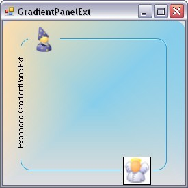

# Overview

The GradientPanelExt is an enhanced version of the GradientPanel control. The GradientPanelExt borders can be rounded to any extent as needed. The control also supports hosting of primitives, in any of the panel borders. These primitives cover a wide range from text to any .NET control. The gradient colors applied to the GradientPanelExt apply to the primitives as well. These are no limitations on the number of these primitives.

## Key Features

**Styles** - Provides different set of styles to the control. The styles are Pattern, Solid, Gradient and None.

**Gradient Style** - Provides different sets of styles to the Gradient. The styles are None, ForwardDiagonal, BackwardDiagonal, Horizontal, Vertical, PathRectangle and PathEllipse.

**Primitives** - Provides option to set the different types of primitives in the borders. The types are Collapse, Image, Text and Host.
