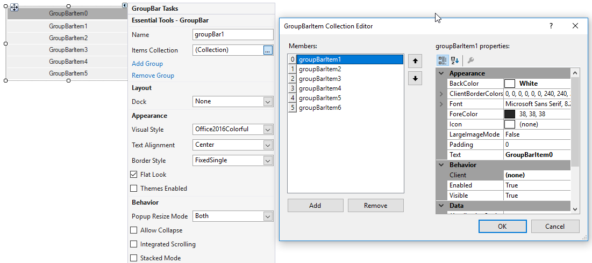

# Getting started

This section describes how to add `GroupBar` control in a Windows Forms application and overview of its basic functionalities.

## Assembly deployment

Refer [control dependencies](https://help.syncfusion.com/windowsforms/control-dependencies#groupbar) section to get the list of assemblies or NuGet package needs to be added as reference to use the control in any application.
 
Please find more details regarding how to install the nuget packages in windows form application in the below link:
 
[How to install nuget packages](https://help.syncfusion.com/windowsforms/nuget-packages)

# Creating simple application with GroupBar

You can create the Windows Forms application with GroupBar control as follows:

1. [Creating project](#creating-the-project)
2. [Adding control via designer](#adding-control-via-designer)
3. [Adding control manually using code](#adding-control-manually-using-code)

### Creating the project

Create a new Windows Forms project in the Visual Studio to display the GroupBar with  functionalities.

## Adding control via designer

The GroupBar control can be added to the application by dragging it from the toolbox and dropping it in a designer view. The following required assembly references will be added automatically:

* Syncfusion.Shared.Base.dll

GroupBarItems can be added into the Groupbar container using `GroupBarItems` collections property.

## Adding control manually using code

To add control manually in C#, follow the given steps:

**Step 1** - Add the following required assembly references to the project:

	* Syncfusion.Shared.Base.dll

**Step 2** - Include the namespaces **Syncfusion.Windows.Forms.Tools**.





using Syncfusion.Windows.Forms.Tools;





Imports Syncfusion.Windows.Forms.Tools



 

**Step 3** - Create `GroupBar` control instance and add it to the form.





GroupBar groupBar1 = new GroupBar();

this.Controls.Add(groupBar1);





Dim groupBar1 As GroupBar = New GroupBar()

Me.Controls.Add(groupBar1)





**Step 4** - GroupBarItems can be added into the Groupbar container using `GroupBarItems` collections property.





GroupBarItem groupBarItem0 = new GroupBarItem();
GroupBarItem groupBarItem1 = new GroupBarItem();
GroupBarItem groupBarItem2 = new GroupBarItem();
GroupBarItem groupBarItem3 = new GroupBarItem();
GroupBarItem groupBarItem4 = new GroupBarItem();
GroupBarItem groupBarItem5 = new GroupBarItem();

this.groupBarItem0.Text = "GroupBarItem0";
this.groupBarItem1.Text = "GroupBarItem1";
this.groupBarItem2.Text = "GroupBarItem2";
this.groupBarItem3.Text = "GroupBarItem3";
this.groupBarItem4.Text = "GroupBarItem4";
this.groupBarItem5.Text = "GroupBarItem5";

this.groupBar1.GroupBarItems.AddRange(new GroupBarItem[] {
            this.groupBarItem0,
            this.groupBarItem1,
            this.groupBarItem2,
            this.groupBarItem3,
            this.groupBarItem4,
            this.groupBarItem5});





Dim groupBarItem0 As GroupBarItem = New GroupBarItem()
Dim groupBarItem1 As GroupBarItem = New GroupBarItem()
Dim groupBarItem2 As GroupBarItem = New GroupBarItem()
Dim groupBarItem3 As GroupBarItem = New GroupBarItem()
Dim groupBarItem4 As GroupBarItem = New GroupBarItem()
Dim groupBarItem5 As GroupBarItem = New GroupBarItem()

Me.groupBarItem0.Text = "GroupBarItem0"
Me.groupBarItem1.Text = "GroupBarItem1"
Me.groupBarItem2.Text = "GroupBarItem2"
Me.groupBarItem3.Text = "GroupBarItem3"
Me.groupBarItem4.Text = "GroupBarItem4"
Me.groupBarItem5.Text = "GroupBarItem5"

Me.groupBar1.GroupBarItems.AddRange(new GroupBarItem[] {
            Me.groupBarItem0,
            Me.groupBarItem1,
            Me.groupBarItem2,
            Me.groupBarItem3,
            Me.groupBarItem4,
            Me.groupBarItem5})





