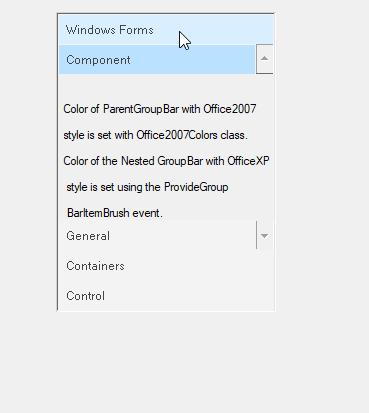
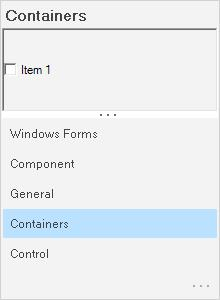
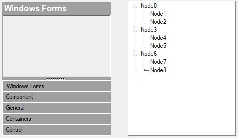
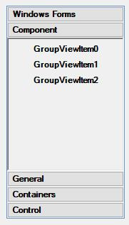
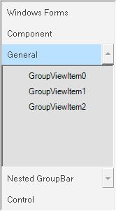
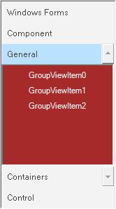
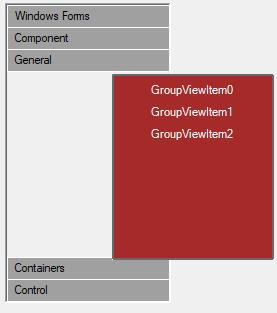

# GroupBar items settings

This section discusses the various settings that can be applied to the GroupBar Items of the GroupBar control.

## Text settings

This section describes how text alignment can be done for the GroupBar Items.

### Through designer

The TextAlign property specifies the horizontal alignment of the GroupBar Item text. The text can be aligned to the Center, Left, and Right. The default alignment is set to Center.

### Through code





this.groupBar1.TextAlign = Syncfusion.Windows.Forms.Tools.TextAlignment.Left;





Me.groupBar1.TextAlign = Syncfusion.Windows.Forms.Tools.TextAlignment.Left

 



### In-place renaming

Users are allowed to rename GroupBar Items at run-time using the code snippet given below.





// index: index of the GroupBar Item to be renamed.

this.groupBar1.InplaceRenameItem(index);





' index: index of the GroupBar Item to be renamed.

Me.groupBar1.InplaceRenameItem(index)





The method associated with this property is given below.

<table>
<tr>
<th>
Method</th><th>
Description</th></tr>
<tr>
<td>
CancelInplaceRenameItem</td><td>
Cancels an in-place edit that is in progress.</td></tr>
</table>

## Image settings

This section describes the image settings available for GroupBar Items.

Large images can be set for GroupBar Items using the following properties.

<table>
<tr>
<th>
GroupBarItem property</th><th>
Description</th></tr>
<tr>
<td>
LargeImageMode</td><td>
Specifies whether large images can be set for the GroupBar Item's client control.</td></tr>
<tr>
<td>
Image</td><td>
Specifies the image for the GroupBar Item's client control. </td></tr>
</table>





this.groupBarItem1.LargeImageMode = true;

this.groupBarItem1.Image = ((System.Drawing.Image)(resources.GetObject("groupBarItem1.Image")));





Me.groupBarItem1.LargeImageMode = True

Me.groupBarItem1.Image = (CType(resources.GetObject("groupBarItem1.Image"), System.Drawing.Image))





Users can also display the selected GroupBar Item's image on the header of the Stacked GroupBar. This can be achieved by setting the ShowItemImageInHeader property to `true`.



 

this.groupBar1.ShowItemImageInHeader = true;





Me.groupBar1.ShowItemImageInHeader = True





 

## GroupBar items customization

The following table lists the properties related to the GroupBar Items.

<table>
<tr>
<th>
GroupBar property</th><th>
Description</th></tr>
<tr>
<td>
BarHighlight</td><td>
Specifies the value which indicates whether to highlight the GroupBar Item when the mouse cursor hovers over it.</td></tr>
<tr>
<td>
FlatLook</td><td>
Specifies whether to draw GroupBar Items with the control's borders without a 3-dimensional edge.</td></tr>
</table>





this.groupBar1.BarHighlight = true;

this.groupBar1.FlatLook = true;





Me.groupBar1.BarHighlight = True

Me.groupBar1.FlatLook = True





The control provides highlighting effect for the GroupBar Item when the mouse is hovered over it by setting the BarHighlight property to `true`.

The border of the GroupBar Items can be changed by drawing the border without 3-dimensional edge which can be attained by setting the FlatLook property to `true`.

## Integrating child controls to the GroupBar items

GroupBar Item can host any control in it's client area. To host more than one control, place the controls in the panel and then drop the panel inside the GroupBar Item container.

### TreeView as child control

You can add a TreeView control to the GroupBar by clicking on a particular group say GroupBarItem1 by activating it and then dragging-and-dropping the TreeView control onto the GroupBar's client region. You can repeat this process for all groups in the control.

Individual GroupBar Item properties such as Text, Image and ForeColor can be set using the GroupBar Item Collection Editor. To do this, first select the GroupBar.GroupBarItems to bring up the collection editor and select each item to assign the property values.

The default GroupBar properties will display the control in the regular mode using the standard visual style. You can now use the property browser to set the appropriate Appearance and Behavior settings to tailor the GroupBar's interface to suit the application's requirement.





this.groupBar1 = new Syncfusion.Windows.Forms.Tools.GroupBar();

this.groupBarItem1 = new Syncfusion.Windows.Forms.Tools.GroupBarItem();

this.groupBarItem2 = new Syncfusion.Windows.Forms.Tools.GroupBarItem();

this.treeView1 = new System.Windows.Forms.TreeView();

// groupBarItem1 has no client control.

this.groupBarItem1.Client = null;

// TreeView control attached as a client control to groupBarItem2.

this.groupBarItem2.Client = this.treeView1;

// Nodes are added to the TreeView Control.

this.treeView1.Nodes.AddRange(new System.Windows.Forms.TreeNode[]{treeNode2});





Me.groupBar1 = New Syncfusion.Windows.Forms.Tools.GroupBar()

Me.groupBarItem1 = New Syncfusion.Windows.Forms.Tools.GroupBarItem()

Me.groupBarItem2 = New Syncfusion.Windows.Forms.Tools.GroupBarItem()

Me.treeView1 = New System.Windows.Forms.TreeView()

' groupBarItem1 has no client control.

Me.groupBarItem1.Client = Nothing

' TreeView control attached as a client control to groupBarItem2.

Me.groupBarItem2.Client = Me.treeView1

' Nodes are added to the TreeView Control.

Me.treeView1.Nodes.AddRange(New System.Windows.Forms.TreeNode() {treeNode2})





  

 

### GroupView as child control

GroupView control can be added as a Child control to the GroupBar Item by dragging-and-dropping the control onto the GroupBar's client region and adding GroupView Items using the GroupView Item Collection Editor.





this.groupBar1 = new Syncfusion.Windows.Forms.Tools.GroupBar();

this.groupBarItem1 = new Syncfusion.Windows.Forms.Tools.GroupBarItem();

this.groupBarItem2 = new Syncfusion.Windows.Forms.Tools.GroupBarItem();

this.groupView1 = new Syncfusion.Windows.Forms.Tools.GroupView();

// groupBarItem1 has no client control.

this.groupBarItem1.Client = null;

// GroupView control attached as a client control to groupBarItem2.

this.groupBarItem2.Client = this.groupView1;

// Items are added to the GroupView Control and their text is edited.

this.groupView1.GroupViewItems.AddRange(new Syncfusion.Windows.Forms.Tools.GroupViewItem[] {

new Syncfusion.Windows.Forms.Tools.GroupViewItem("GroupViewItem0", -1, true, null, "GroupViewItem0"),

new Syncfusion.Windows.Forms.Tools.GroupViewItem("GroupViewItem1", -1, true, null, "GroupViewItem1")});





Me.groupBar1 = New Syncfusion.Windows.Forms.Tools.GroupBar()

Me.groupBarItem1 = New Syncfusion.Windows.Forms.Tools.GroupBarItem()

Me.groupBarItem2 = New Syncfusion.Windows.Forms.Tools.GroupBarItem()

Me.groupView1 = New Syncfusion.Windows.Forms.Tools.GroupView()

' groupBarItem1 has no client control. 

Me.groupBarItem1.Client = Nothing

' GroupView control attached as a client control to groupBarItem2.

Me.groupBarItem2.Client = Me.groupView1

' Items are added to the GroupView Control and their text is edited.

Me.groupView1.GroupViewItems.AddRange(New Syncfusion.Windows.Forms.Tools.GroupViewItem() {New Syncfusion.Windows.Forms.Tools.GroupViewItem("GroupViewItem0", -1, True, Nothing, "GroupViewItem0"), New Syncfusion.Windows.Forms.Tools.GroupViewItem("GroupViewItem1", -1, True, Nothing, "GroupViewItem1")})





 

### GroupBar as child control

GroupBar control itself can be placed in the client region of the GroupBar Item. This is called Nested GroupBar.

The following step-by-step procedure helps you to create Nested GroupBars.

1. Drag and drop the GroupBar1 control from the toolbox onto the form, add GroupBar Items using the GroupBar Item Collection Editor, drag and drop the GroupView control and add GroupView Items using the GroupView Item Collection Editor. Associate the GroupView control inside the client area of the GroupBar Item.
2. The below screen shot shows the GroupBar with four GroupBar Items named as Windows Forms, Components, General and Nested GroupBar.

 

3. Drag and drop another GroupBar2 control from the toolbox and add the GroupBar Items (Personal, Work and Contacts) using the GroupBar Item Collection Editor and add the GroupView control with GroupView Items (Vendors, Metrics, Trend, Sales and Sales 2 for the GroupBar Item Work) to each GroupBar Item using the GroupView Item Collection Editor.

 

4. Add GroupBar2 as child control to the GroupBar1 by doing a drag and drop operation.

 

The following screenshot shows the Nested GroupBars.

 





this.groupBar1 = new Syncfusion.Windows.Forms.Tools.GroupBar();

this.groupBarItem1 = new Syncfusion.Windows.Forms.Tools.GroupBarItem();

this.groupBarItem2 = new Syncfusion.Windows.Forms.Tools.GroupBarItem();

this.groupBar2 = new Syncfusion.Windows.Forms.Tools.GroupBar();

this.groupBarItem3 = new Syncfusion.Windows.Forms.Tools.GroupBarItem();

this.groupBarItem4 = new Syncfusion.Windows.Forms.Tools.GroupBarItem();

// groupBarItem1 has no client control.

this.groupBarItem1.Client = null;

// GroupBar control attached as a client control to groupBarItem2.

this.groupBarItem2.Client = this.groupBar2;

// Items are added to the GroupBar Control.

this.groupBar2.GroupBarItems.AddRange(new Syncfusion.Windows.Forms.Tools.GroupBarItem[] {

this.groupBarItem3,

this.groupBarItem4});





Me.groupBar1 = New Syncfusion.Windows.Forms.Tools.GroupBar()

Me.groupBarItem1 = New Syncfusion.Windows.Forms.Tools.GroupBarItem()

Me.groupBarItem2 = New Syncfusion.Windows.Forms.Tools.GroupBarItem()

Me.groupBar2 = New Syncfusion.Windows.Forms.Tools.GroupBar()

Me.groupBarItem3 = New Syncfusion.Windows.Forms.Tools.GroupBarItem()

Me.groupBarItem4 = New Syncfusion.Windows.Forms.Tools.GroupBarItem()

' groupBarItem1 has no client control.

Me.groupBarItem1.Client = Nothing

' GroupBar control attached as a client control to groupBarItem2.

Me.groupBarItem2.Client = Me.groupBar2

' Items are added to the GroupBar Control.

Me.groupBar2.GroupBarItems.AddRange(New Syncfusion.Windows.Forms.Tools.GroupBarItem() {Me.groupBarItem3, Me.groupBarItem4})





## GroupBarItem pop-up

The below properties controls the appearance and behavior of the GroupBarItem pop-up.

<table>
<tr>
<th>
GroupBar property</th><th>
Description</th></tr>
<tr>
<td>
PopupAutoClose</td><td>
Indicates whether popup is closed after clicking an item.</td></tr>
<tr>
<td>
PopupClientSize</td><td>
Indicates the initial size of the popup for the GroupBarItem client.</td></tr>
<tr>
<td>
PopupResizeMode</td><td>
Gets or sets the popup's resize mode. It can be horizontal, vertical, Both or None.</td></tr>
<tr>
<td>
ShowPopupGripper</td><td>
Specifies whether to show or hide the popup gripper.</td></tr>
</table>

<table>
<tr>
<th>
GroupBar property</th><th>
Description</th></tr>
<tr>
<td>
HidePopup</td><td>
Calling this method will hide the popup.</td></tr>
</table>





this.groupBar1.PopupClientSize = new System.Drawing.Size(5, 6);

this.groupBar1.PopupResizeMode = Syncfusion.Windows.Forms.Tools.PopupResizeMode.Vertical;

this.groupBar1.PopupAutoClose = true;

this.groupBar1.ShowPopupGripper = true;

this.groupBar1.HidePopup();





Me.groupBar1.PopupClientSize = New System.Drawing.Size(5, 6) 

Me.groupBar1.PopupResizeMode = Syncfusion.Windows.Forms.Tools.PopupResizeMode.Vertical 

Me.groupBar1.PopupAutoClose = True 

Me.groupBar1.ShowPopupGripper = True 

Me.groupBar1.HidePopup()



