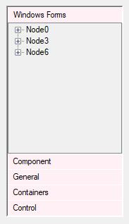
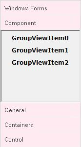

# Header customization settings

## Header height and font settings

The [GroupBarItemHeight](https://help.syncfusion.com/cr/windowsforms/Syncfusion.Shared.Base~Syncfusion.Windows.Forms.Tools.GroupBar~GroupBarItemHeight.html) and [Font](https://docs.microsoft.com/en-us/dotnet/api/system.windows.forms.control.font?redirectedfrom=MSDN&view=netframework-4.7.2#System_Windows_Forms_Control_Font) properties can be used to change the height and font of the header of the GroupBar Items.





this.groupBar1.GroupBarItemHeight = 30;

this.groupBar1.Font = new System.Drawing.Font("Verdana", 9F, System.Drawing.FontStyle.Regular, System.Drawing.GraphicsUnit.Point, ((byte)(0)));





Me.groupBar1.GroupBarItemHeight = 30 

Me.groupBar1.Font = New System.Drawing.Font("Verdana", 9F, System.Drawing.FontStyle.Regular, System.Drawing.GraphicsUnit.Point, CByte((0))) 





 

## Header BackColor and ForeColor settings

You can customize the group bar items header backcolor and fore color by using [HeaderBackColor](https://help.syncfusion.com/cr/windowsforms/Syncfusion.Shared.Base~Syncfusion.Windows.Forms.Tools.GroupBar~HeaderBackColor.html) and [HeaderForeColor](https://help.syncfusion.com/cr/windowsforms/Syncfusion.Shared.Base~Syncfusion.Windows.Forms.Tools.GroupBar~HeaderForeColor.html) properties.



  

this.groupBar1.HeaderBackColor = System.Drawing.Color.LavenderBlush;

this.groupBar1.HeaderForeColor = System.Drawing.Color.Silver;



 

Me.groupBar1.HeaderBackColor = System.Drawing.Color.Red

Me.groupBar1.HeaderForeColor = System.Drawing.Color.Maroon





 
 
GroupBar Items with Background Color = "LavenderBlush" and Foreground Color = "Silver"
{:.caption}

The methods given below are used to reset the above properties.

* [ResetHeaderFont](https://help.syncfusion.com/cr/windowsforms/Syncfusion.Shared.Base~Syncfusion.Windows.Forms.Tools.GroupBar~ResetHeaderFont.html)
* [ResetHeaderBackcolor](https://help.syncfusion.com/cr/windowsforms/Syncfusion.Shared.Base~Syncfusion.Windows.Forms.Tools.GroupBar~ResetHeaderBackColor.html)
* [ResetHeaderForeColor](https://help.syncfusion.com/cr/windowsforms/Syncfusion.Shared.Base~Syncfusion.Windows.Forms.Tools.GroupBar~ResetHeaderForeColor.html)

