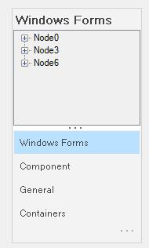
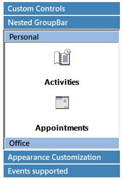

# Themes and animation settings

Themes define the look and feel of the whole GroupBar. It also changes the behavior of the GroupBar completely. Themes can be enabled by setting the ThemesEnabled property of GroupBar to `true`.



  

this.groupBar1.ThemesEnabled = true;





Me.groupBar1.ThemesEnabled = True





Themed look of Office 2007 Style GroupBar
{:.caption}

## Animation settings

Switching between the different GroupBar Items can be animated by setting the AnimatedSelection property to `true`.





this.groupBar1.AnimatedSelection = true;

 

 
 


Me.groupBar1.AnimatedSelection = true





