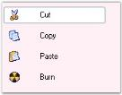

---
layout: post
title: Apply Themes in Windows Forms GroupView | Syncfusion®
description: Applying themes enables XP-themed rendering and visual style customization for improving GroupView appearance.
platform: WindowsForms
control: GroupView
documentation: ug
---
# Apply Themes in Windows Forms GroupView

The Themes Enabled property specifies whether XP Themes should be used for drawing the control. Themes can be enabled by setting the [ThemesEnabled](https://help.syncfusion.com/cr/windowsforms/Syncfusion.Windows.Forms.Tools.GroupView.html#Syncfusion_Windows_Forms_Tools_GroupView_ThemesEnabled) property of GroupView to `true`.





this.groupView1.ThemesEnabled = true;





Me.groupView1.ThemesEnabled = True





 
