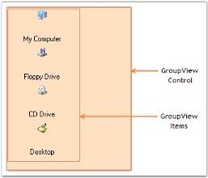

# About Syncfusion® Windows Forms GroupView Control

The various sections of GroupView and their description are given below.

 

## GroupView control

The GroupView control is a List-type control that can display a list of items.

## GroupView items

GroupView items can be used to display text and images.

The Appearance of the GroupView Items can be customized using the various properties provided in the GroupViewItem Collection Editor.
