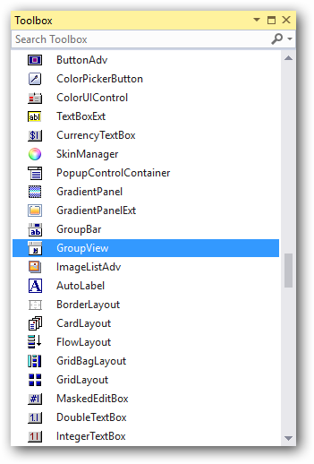

# Getting Started with Windows Forms GroupView

This section describes how to add [GroupView](https://help.syncfusion.com/cr/windowsforms/Syncfusion.Windows.Forms.Tools.GroupView.html) control in a Windows Forms application and overview of its basic functionalities.

## Assembly deployment

Refer to the [Control Dependencies](https://help.syncfusion.com/windowsforms/control-dependencies#groupview) section to get the list of assemblies or details of NuGet package that needs to be added as reference to use the control in any application.

Refer to [NuGet Packages](https://help.syncfusion.com/windowsforms/installation/install-nuget-packages) to learn how to install nuget packages in a Windows Forms application.

## Adding GroupView control via designer

1) Create a new Windows Forms project in the Visual Studio.

2) Add the [GroupView](https://help.syncfusion.com/cr/windowsforms/Syncfusion.Windows.Forms.Tools.GroupView.html) control to an application by dragging it from the toolbox to a designer view. The following dependent assembly will be added automatically:

* Syncfusion.Shared.Base

3) Right-click the control, click **Properties**, and then select [GroupViewItems](https://help.syncfusion.com/cr/windowsforms/Syncfusion.Windows.Forms.Tools.GroupView.html#Syncfusion_Windows_Forms_Tools_GroupView_GroupViewItems). Now, the **GroupViewItem Collection Editor** will be opened. Click **Add** to add group view items to the control.

## Adding GroupView control via code

To add the control manually in C#, follow the given steps:

1) Create a C# or VB application via Visual Studio.

2) Add the following assembly reference to the project:

* Syncfusion.Shared.Base

3) Include the required namespace.





using Syncfusion.Windows.Forms.Tools;





Imports Syncfusion.Windows.Forms.Tools



 

4) Create an instance of the [GroupView](https://help.syncfusion.com/cr/windowsforms/Syncfusion.Windows.Forms.Tools.GroupView.html) control, and then add it to the form.





GroupView groupView1 = new GroupView();

this.Controls.Add(groupView1);





Dim groupView1 As GroupView = New GroupView()

Me.Controls.Add(groupView1)





5) Add items to GroupView container using the [GroupViewItems](https://help.syncfusion.com/cr/windowsforms/Syncfusion.Windows.Forms.Tools.GroupView.html#Syncfusion_Windows_Forms_Tools_GroupView_GroupViewItems) collection property.





this.groupView1.GroupViewItems.AddRange(new GroupViewItem[] {
            new GroupViewItem("GroupViewItem0",0,true, null, "GroupViewItem0"),
            new GroupViewItem("GroupViewItem1",1,true, null, "GroupViewItem0"),
            new GroupViewItem("GroupViewItem2",2,true, null, "GroupViewItem0")});
this.groupView1.FlatLook = true;





Me.groupView1.GroupViewItems.AddRange(New GroupViewItem() { 
            New GroupViewItem("GroupViewItem0",0,True, Nothing, "GroupViewItem0"), 
            New GroupViewItem("GroupViewItem1",1,True, Nothing, "GroupViewItem0"), 
            New GroupViewItem("GroupViewItem2",2,True, Nothing, "GroupViewItem0"True, Nothing, "GroupViewItem0")})
Me.groupView1.FlatLook = True





## Adding images

To add images to the GroupView, ImageList control must be added to the form with images.




ImageList imageList1 = new ImageList();
imageList1.ImageStream = ((System.Windows.Forms.ImageListStreamer)(resources.GetObject("imageList1.ImageStream")));
this.imageList1.Images.SetKeyName(0, "holo.png");
this.imageList1.Images.SetKeyName(1, "edge.png");
this.imageList1.Images.SetKeyName(2, "light.png");




Dim imageList1 As New ImageList()
imageList1.ImageStream = (CType(resources.GetObject("imageList1.ImageStream"), System.Windows.Forms.ImageListStreamer))
Me.imageList1.Images.SetKeyName(0, "holo.png")
Me.imageList1.Images.SetKeyName(1, "edge.png")
Me.imageList1.Images.SetKeyName(2, "light.png")




After adding images, assign **ImageList** to the [SmallImageList](https://help.syncfusion.com/cr/windowsforms/Syncfusion.Windows.Forms.Tools.GroupView.html#Syncfusion_Windows_Forms_Tools_GroupView_SmallImageList) property, and then set the [SmallImageView](https://help.syncfusion.com/cr/windowsforms/Syncfusion.Windows.Forms.Tools.GroupView.html#Syncfusion_Windows_Forms_Tools_GroupView_SmallImageView) property to `true` for the **GroupView** control.




groupView1.SmallImageList = this.imageList1;
groupView1.SmallImageView = true;




groupView1.SmallImageList = Me.imageList1
groupView1.SmallImageView = True




## Selected item

At run time, a particular item can be selected using the [SelectedItem](https://help.syncfusion.com/cr/windowsforms/Syncfusion.Windows.Forms.Tools.GroupView.html#Syncfusion_Windows_Forms_Tools_GroupView_SelectedItem) property.




groupView1.SelectedItem = 1;




groupView1.SelectedItem = 1




