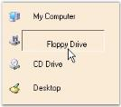
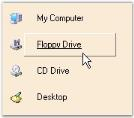

# GroupView Items Settings in Windows Forms GroupView

This section discusses the various settings that can be applied to the GroupView Items of the GroupView control.

## Text settings

This section describes the text alignment options available for GroupView.

### Text highlighting

The GroupView control provides highlighting of text when the mouse is over the GroupView Item. This can be activated by setting the [HighlightText](https://help.syncfusion.com/cr/windowsforms/Syncfusion.Windows.Forms.Tools.GroupView.html#Syncfusion_Windows_Forms_Tools_GroupView_HighlightText) property to 'True'.





this.groupView1.HighlightText = true;

 

 


Me.groupView1.HighlightText = True





 
 
 "My Computer" Item is Highlighted in the GroupView Control
 {:.caption} 

### Text offset

The following properties are used to set the text offset for the GroupView Items.

* [HighlightTextOffset](https://help.syncfusion.com/cr/windowsforms/Syncfusion.Windows.Forms.Tools.GroupView.html#Syncfusion_Windows_Forms_Tools_GroupView_HighlightTextOffset)
* [SelectedHighlightTextOffset](https://help.syncfusion.com/cr/windowsforms/Syncfusion.Windows.Forms.Tools.GroupView.html#Syncfusion_Windows_Forms_Tools_GroupView_SelectedHighlightTextOffset)
* [SelectingTextOffset](https://help.syncfusion.com/cr/windowsforms/Syncfusion.Windows.Forms.Tools.GroupView.html#Syncfusion_Windows_Forms_Tools_GroupView_SelectingTextOffset)
* [SelectedTextOffset](https://help.syncfusion.com/cr/windowsforms/Syncfusion.Windows.Forms.Tools.GroupView.html#Syncfusion_Windows_Forms_Tools_GroupView_SelectedImageOffset)

N> [HighlightText](https://help.syncfusion.com/cr/windowsforms/Syncfusion.Windows.Forms.Tools.GroupView.html#Syncfusion_Windows_Forms_Tools_GroupView_HighlightText) property must be set to 'True' in all the cases.





this.groupView1.HighlightTextOffset = new System.Drawing.Point(10, 5);

this.groupView1.SelectedHighlightTextOffset = new System.Drawing.Point(20, 6);

this.groupView1.SelectedTextOffset = new System.Drawing.Point(30, 7);

this.groupView1.SelectingTextOffset = new System.Drawing.Point(40, 8);





Me.groupView1.HighlightTextOffset = New System.Drawing.Point(10, 5)

Me.groupView1.SelectedHighlightTextOffset = New System.Drawing.Point(20, 6)

Me.groupView1.SelectedTextOffset = New System.Drawing.Point(30, 7)

Me.groupView1.SelectingTextOffset = New System.Drawing.Point(40, 8)





  

 

 

  

The methods associated with these properties are given below.

* [ResetHighlightTextOffset](https://help.syncfusion.com/cr/windowsforms/Syncfusion.Windows.Forms.Tools.GroupView.html#Syncfusion_Windows_Forms_Tools_GroupView_ResetHighlightTextOffset)
* [ResetSelectedHighlightTextOffset](https://help.syncfusion.com/cr/windowsforms/Syncfusion.Windows.Forms.Tools.GroupView.html#Syncfusion_Windows_Forms_Tools_GroupView_ResetSelectedHighlightTextOffset)
* [ResetSelectingTextOffset](https://help.syncfusion.com/cr/windowsforms/Syncfusion.Windows.Forms.Tools.GroupView.html#Syncfusion_Windows_Forms_Tools_GroupView_ResetSelectingTextOffset)
* [ResetSelectedTextOffset](https://help.syncfusion.com/cr/windowsforms/Syncfusion.Windows.Forms.Tools.GroupView.html#Syncfusion_Windows_Forms_Tools_GroupView_ResetSelectedTextOffset)

### Text formatting

The following table lists the text formatting properties of GroupView Control.

* [TextSpacing](https://help.syncfusion.com/cr/windowsforms/Syncfusion.Windows.Forms.Tools.GroupView.html#Syncfusion_Windows_Forms_Tools_GroupView_TextSpacing)
* [TextUnderline](https://help.syncfusion.com/cr/windowsforms/Syncfusion.Windows.Forms.Tools.GroupView.html#Syncfusion_Windows_Forms_Tools_GroupView_TextUnderline)
* [TextWrap](https://help.syncfusion.com/cr/windowsforms/Syncfusion.Windows.Forms.Tools.GroupView.html#Syncfusion_Windows_Forms_Tools_GroupView_TextWrap)

 

  



  

this.groupView1.TextSpacing = 15;

this.groupView1.TextUnderline = true;

this.groupView1.TextWrap = true;





Me.groupView1.TextSpacing = 15

Me.groupView1.TextUnderline = True

Me.groupView1.TextWrap = True





### In-place renaming

It is possible to rename the specified GroupView Item at run-time using the [InplaceRenameItem](https://help.syncfusion.com/cr/windowsforms/Syncfusion.Windows.Forms.Tools.GroupView.html#Syncfusion_Windows_Forms_Tools_GroupView_InplaceRenameItem_System_Int32_) method.





// index: index of the GroupView Item to be renamed.

this.groupView1.InplaceRenameItem(index);





' index: index of the GroupView Item to be renamed.

Me.groupView1.InplaceRenameItem(index)





<table>
<tr>
<th>
Method</th><th>
Description</th></tr>
<tr>
<td>
CancelInplaceRenameItemAt</td><td>
Cancels an in-place edit that is in progress.</td></tr>
</table>

## Color settings

This section describes the color settings available for GroupView.

### Highlighting items and text

The color for highlighting Items and text during mouse hover can be specified using the properties given below.

* [HighlightItemColor](https://help.syncfusion.com/cr/windowsforms/Syncfusion.Windows.Forms.Tools.GroupView.html#Syncfusion_Windows_Forms_Tools_GroupView_HighlightItemColor)
* [HighlightTextColor](https://help.syncfusion.com/cr/windowsforms/Syncfusion.Windows.Forms.Tools.GroupView.html#Syncfusion_Windows_Forms_Tools_GroupView_HighlightTextColor)

N> [HighlightText](https://help.syncfusion.com/cr/windowsforms/Syncfusion.Windows.Forms.Tools.GroupView.html#Syncfusion_Windows_Forms_Tools_GroupView_HighlightText) property must be set to 'True' in both the cases.





this.groupView1.HighlightItemColor = System.Drawing.Color.LavendarBlush;

this.groupView1.HighlightTextColor = System.Drawing.Color.Purple;





Me.groupView1.HighlightItemColor = System.Drawing.Color.LavendarBlush

Me.groupView1.HighlightTextColor = System.Drawing.Color.Purple





 

The following table lists the methods related to the above properties.

* [ResetHighlightItemColor](https://help.syncfusion.com/cr/windowsforms/Syncfusion.Windows.Forms.Tools.GroupView.html#Syncfusion_Windows_Forms_Tools_GroupView_ResetHighlightItemColor)
* [ResetHighlightTextColor](https://help.syncfusion.com/cr/windowsforms/Syncfusion.Windows.Forms.Tools.GroupView.html#Syncfusion_Windows_Forms_Tools_GroupView_ResetHighlightTextColor)

### Highlighting selected items and text

The color for highlighting selected Items and text can be specified using the properties given below.

[SelectedHighlightItemColor](https://help.syncfusion.com/cr/windowsforms/Syncfusion.Windows.Forms.Tools.GroupView.html#Syncfusion_Windows_Forms_Tools_GroupView_SelectedHighlightItemColor)
[SelectedHighlightTextColor](https://help.syncfusion.com/cr/windowsforms/Syncfusion.Windows.Forms.Tools.GroupView.html#Syncfusion_Windows_Forms_Tools_GroupView_SelectedHighlightTextColor)
[SelectedItemColor](https://help.syncfusion.com/cr/windowsforms/Syncfusion.Windows.Forms.Tools.GroupView.html#Syncfusion_Windows_Forms_Tools_GroupView_SelectedItemColor)
[SelectedTextColor](https://help.syncfusion.com/cr/windowsforms/Syncfusion.Windows.Forms.Tools.GroupView.html#Syncfusion_Windows_Forms_Tools_GroupView_SelectedTextColor)
[SelectingItemColor](https://help.syncfusion.com/cr/windowsforms/Syncfusion.Windows.Forms.Tools.GroupView.html#Syncfusion_Windows_Forms_Tools_GroupView_SelectingItemColor)
[SelectingTextColor](https://help.syncfusion.com/cr/windowsforms/Syncfusion.Windows.Forms.Tools.GroupView.html#Syncfusion_Windows_Forms_Tools_GroupView_SelectingTextColor)

N> [HighlightText](https://help.syncfusion.com/cr/windowsforms/Syncfusion.Windows.Forms.Tools.GroupView.html#Syncfusion_Windows_Forms_Tools_GroupView_HighlightText) property must be set to 'True' in all the cases.





this.groupView1.SelectedHighlightItemColor = System.Drawing.Color.LightBlue;

this.groupView1.SelectedHighlightTextColor = System.Drawing.Color.Crimson;

this.groupView1.SelectedItemColor = System.Drawing.Color.LightGreen;

this.groupView1.SelectedTextColor = System.Drawing.Color.Blue;

this.groupView1.SelectingItemColor = System.Drawing.Color.PeachPuff;

this.groupView1.SelectingTextColor = System.Drawing.Color.Red;



 

Me.groupView1.SelectedHighlightItemColor = System.Drawing.Color.LightBlue

Me.groupView1.SelectedHighlightTextColor = System.Drawing.Color.Crimson

Me.groupView1.SelectedItemColor = System.Drawing.Color.LightGreen

Me.groupView1.SelectedTextColor = System.Drawing.Color.Blue

Me.groupView1.SelectingItemColor = System.Drawing.Color.PeachPuff

Me.groupView1.SelectingTextColor = System.Drawing.Color.Red





 

 

  

The following table lists the methods related to the above properties.

[ResetSelectedHighlightItemColor](https://help.syncfusion.com/cr/windowsforms/Syncfusion.Windows.Forms.Tools.GroupView.html#Syncfusion_Windows_Forms_Tools_GroupView_ResetSelectedHighlightItemColor)
[ResetSelectedHighlightTextColor](https://help.syncfusion.com/cr/windowsforms/Syncfusion.Windows.Forms.Tools.GroupView.html#Syncfusion_Windows_Forms_Tools_GroupView_ResetSelectedHighlightTextColor)
[ResetSelectedItemColor](https://help.syncfusion.com/cr/windowsforms/Syncfusion.Windows.Forms.Tools.GroupView.html#Syncfusion_Windows_Forms_Tools_GroupView_ResetSelectedItemColor)
[ResetSelectedTextColor](https://help.syncfusion.com/cr/windowsforms/Syncfusion.Windows.Forms.Tools.GroupView.html#Syncfusion_Windows_Forms_Tools_GroupView_ResetSelectedTextColor)
[ResetSelectingItemColor](https://help.syncfusion.com/cr/windowsforms/Syncfusion.Windows.Forms.Tools.GroupView.html#Syncfusion_Windows_Forms_Tools_GroupView_ResetSelectingItemColor)
[ResetSelectingTextColor](https://help.syncfusion.com/cr/windowsforms/Syncfusion.Windows.Forms.Tools.GroupView.html#Syncfusion_Windows_Forms_Tools_GroupView_ResetSelectingTextColor)

## Orientation settings for GroupView item

The following table lists the properties related to the orientation of GroupView Items.

* [FlowView](https://help.syncfusion.com/cr/windowsforms/Syncfusion.Windows.Forms.Tools.GroupView.html#Syncfusion_Windows_Forms_Tools_GroupView_FlowView)
* [FlowViewItemTextLength](https://help.syncfusion.com/cr/windowsforms/Syncfusion.Windows.Forms.Tools.GroupView.html#Syncfusion_Windows_Forms_Tools_GroupView_FlowViewItemTextLength)
* [ShowFlowViewItemText](https://help.syncfusion.com/cr/windowsforms/Syncfusion.Windows.Forms.Tools.GroupView.html#Syncfusion_Windows_Forms_Tools_GroupView_ShowFlowViewItemText)
* [Orientation](https://help.syncfusion.com/cr/windowsforms/Syncfusion.Windows.Forms.Tools.GroupView.html#Syncfusion_Windows_Forms_Tools_GroupView_Orientation)



 

this.groupView1.FlowView = true;

this.groupView1.FlowViewItemTextLength = 45;

this.groupView1.ShowFlowViewItemText = true;

this.groupView1.Orientation = Syncfusion.Windows.Forms.Tools.GroupViewOrientation.Horizontal;

 

 

Me.groupView1.FlowView = True

Me.groupView1.FlowViewItemTextLength = 45

Me.groupView1.ShowFlowViewItemText = True

Me.groupView1.Orientation = Syncfusion.Windows.Forms.Tools.GroupViewOrientation.Horizontal





The GroupView Items in the GroupView control can be arranged in the horizontal and vertical direction, with or without displaying text. FlowView property displays the GroupView Items with images and without text.

If you want to show the GroupView Item's text in the FlowView mode then set the ShowFlowViewItemText property to 'True'. You can also control the length of the GroupView Item's text in the FlowView mode using the FlowViewItemTextLength property.

 

  

The [Orientation](https://help.syncfusion.com/cr/windowsforms/Syncfusion.Windows.Forms.Tools.GroupView.html#Syncfusion_Windows_Forms_Tools_GroupView_Orientation) property determines the direction of display for the GroupView Items.

