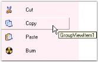

# Interactive features

User can determine whether the particular GroupView Item is selected or not using the ButtonView and [ClipSelectionBounds](https://help.syncfusion.com/cr/windowsforms/Syncfusion.Shared.Base~Syncfusion.Windows.Forms.Tools.GroupView~ClipSelectionBounds.html) properties. [ButtonView](https://help.syncfusion.com/cr/windowsforms/Syncfusion.Shared.Base~Syncfusion.Windows.Forms.Tools.GroupView~ButtonView.html) displays the selected GroupView Item in the pressed state.

[ButtonView](https://help.syncfusion.com/cr/windowsforms/Syncfusion.Shared.Base~Syncfusion.Windows.Forms.Tools.GroupView~ButtonView.html) can be enabled in the GroupView control at design-time by setting the [SelectedItem](https://help.syncfusion.com/cr/windowsforms/Syncfusion.Shared.Base~Syncfusion.Windows.Forms.Tools.GroupView~SelectedItem.html) property to integer values which in turn represents the GroupView Item. [ClipSelectionBounds](https://help.syncfusion.com/cr/windowsforms/Syncfusion.Shared.Base~Syncfusion.Windows.Forms.Tools.GroupView~ClipSelectionBounds.html) displays a white border around the selected GroupView Item.



  

this.groupView1.ButtonView = true;

this.groupView1.ClipSelectionBounds = true;



 

Me.groupView1.ButtonView = True

Me.groupView1.ClipSelectionBounds = True





 
 
 ButtonView of the 'Cut' Item
 {:.caption}
 
## ToolTips

The [ToolTipText](https://help.syncfusion.com/cr/windowsforms/Syncfusion.Shared.Base~Syncfusion.Windows.Forms.Tools.GroupViewItem~ToolTipText.html) property of the GroupView control can be used to set the text of the tooltip. The [ShowToolTips](https://help.syncfusion.com/cr/windowsforms/Syncfusion.Shared.Base~Syncfusion.Windows.Forms.Tools.GroupView~ShowToolTips.html) property must be set to `true` in order to make the tooltip visible.



 

// Set the tooltip text for the GroupView Item. 

this.groupView1.GroupViewItems[0].ToolTipText = "GroupViewItem1";

this.groupView1.ShowToolTips = true;

 



' Set the tooltip text for the GroupView Item. 

Me.groupView1.GroupViewItems(0).ToolTipText = "GroupViewItem1"

Me.groupView1.ShowToolTips = True





 
