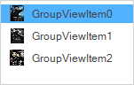

# About the Syncfusion® Windows Forms GroupView Control 

The [GroupView](https://help.syncfusion.com/cr/windowsforms/Syncfusion.Windows.Forms.Tools.GroupView.html) control implements a selectable list that can display a collection of items, where each item is represented by an image and a descriptor. It is capable of displaying items with large or small icons in various combinable styles such as the default selectable style, button-type selection, full-item select and an icon-only flow view mode. 

## Key features 

* **Text settings** - Provides options to customize color, underline, text wrap, rename, and spacing of the text at run time. For more details, refer to the [GroupView Items Settings](https://help.syncfusion.com/windowsforms/groupview/groupview-items-settings) documentation.

* **Image settings** - Provides options to add large images or small images and to customize their appearance and user interactive offsets. For more details, refer to the [Image Settings](https://help.syncfusion.com/windowsforms/groupview/image-settings-of-groupview) documentation.

* **Drag and drop** - Provides options to drag and drop all the objects within GroupView container. For more details, refer to the [GroupView Settings](https://help.syncfusion.com/windowsforms/groupview/groupview-settings) documentation.

* **Spacing** - Provides support to set the user-defined image spacing, text spacing, and X and Y spacing in between items using int values. For more details, refer to the [GroupView Settings](https://help.syncfusion.com/windowsforms/groupview/groupview-settings) documentation.

* **Visual style** - Supports a rich set of visual styles to customize the look and feel of GroupView. For more details, refer to the [Applying Themes](https://help.syncfusion.com/windowsforms/groupview/applying-themes) documentation.

## See also

* [Getting Started](https://help.syncfusion.com/windowsforms/groupview/getting-started)
* [Interactive Features](https://help.syncfusion.com/windowsforms/groupview/interactive-features)
* [Events](https://help.syncfusion.com/windowsforms/groupview/groupview-events)
* [Adding GroupView to GroupBar](https://help.syncfusion.com/windowsforms/groupview/adding-groupview-to-groupbar)
