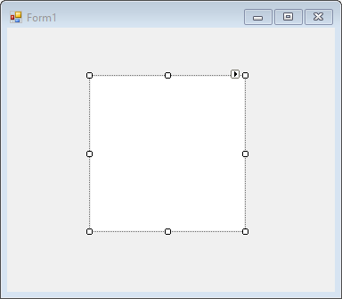
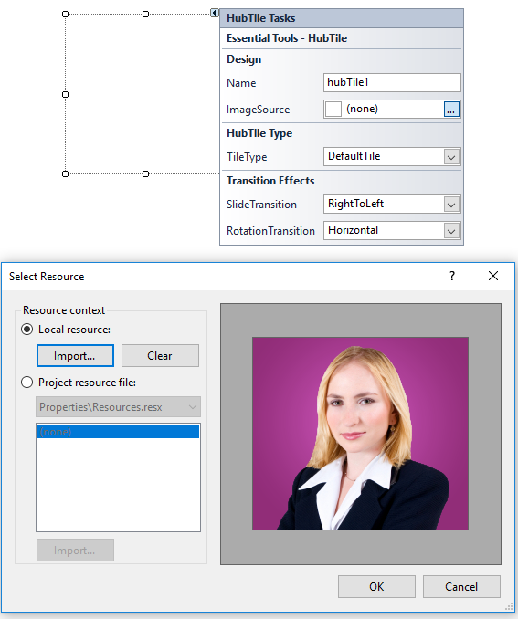

# Getting started

This section describes how to add `HubTile` control in a Windows Forms application and overview of its basic functionalities.

## Assembly deployment

Refer [control dependencies](https://help.syncfusion.com/windowsforms/control-dependencies#hubtile) section to get the list of assemblies or NuGet package needs to be added as reference to use the control in any application. 
 
Please find more details regarding how to install the nuget packages in windows form application in the below link:
 
[How to install nuget packages](https://help.syncfusion.com/windowsforms/nuget-packages)

# Creating simple application with HubTile

You can create the Windows Forms application with HubTile control as follows:

1. [Creating project](#creating-the-project)
2. [Adding control via designer](#adding-control-via-designer)
3. [Adding control manually using code](#adding-control-manually-using-code)
4. [Customize background image](#customize-background-image)

### Creating the project

Create a new Windows Forms project in the Visual Studio to display the HubTile with  functionalities.

## Adding control via designer

The HubTile control can be added to the application by dragging it from the toolbox and dropping it in a designer view. The following required assembly references will be added automatically:

* Syncfusion.Grid.Base.dll
* Syncfusion.Grid.Windows.dll
* Syncfusion.Shared.Base.dll
* Syncfusion.Shared.Windows.dll
* Syncfusion.Tools.Base.dll
* Syncfusion.Tools.Windows.dll

## Adding control manually using code

To add control manually in C#, follow the given steps:

**Step 1** - Add the following required assembly references to the project:

* Syncfusion.Grid.Base.dll
* Syncfusion.Grid.Windows.dll
* Syncfusion.Shared.Base.dll
* Syncfusion.Shared.Windows.dll
* Syncfusion.Tools.Base.dll
* Syncfusion.Tools.Windows.dll

**Step 2** - Include the namespaces **Syncfusion.Windows.Forms.Tools**.





using Syncfusion.Windows.Forms.Tools;





Imports Syncfusion.Windows.Forms.Tools



 

**Step 3** - Create `HubTile` control instance and add it to the form.





HubTile HubTile1 = new HubTile();

this.Controls.Add(HubTile1);





Dim hubTile1 As HubTile = New HubTile()

Me.Controls.Add(hubTile1)





## Customize background image

Background image can be added to HubTile through designer as well as through code.

**Adding background image through designer**

Background image can be added to HubTile using `ImageSource` property in SmartTag.

**Adding background image manually through code**

Background image can be added to HubTile using `ImageSource` property in HubTile class.





this.hubTile1.ImageSource = ((System.Drawing.Image)(resources.GetObject("hubTile1.ImageSource")));





Me.hubTile1.ImageSource = ((System.Drawing.Image)(resources.GetObject("hubTile1.ImageSource")))





